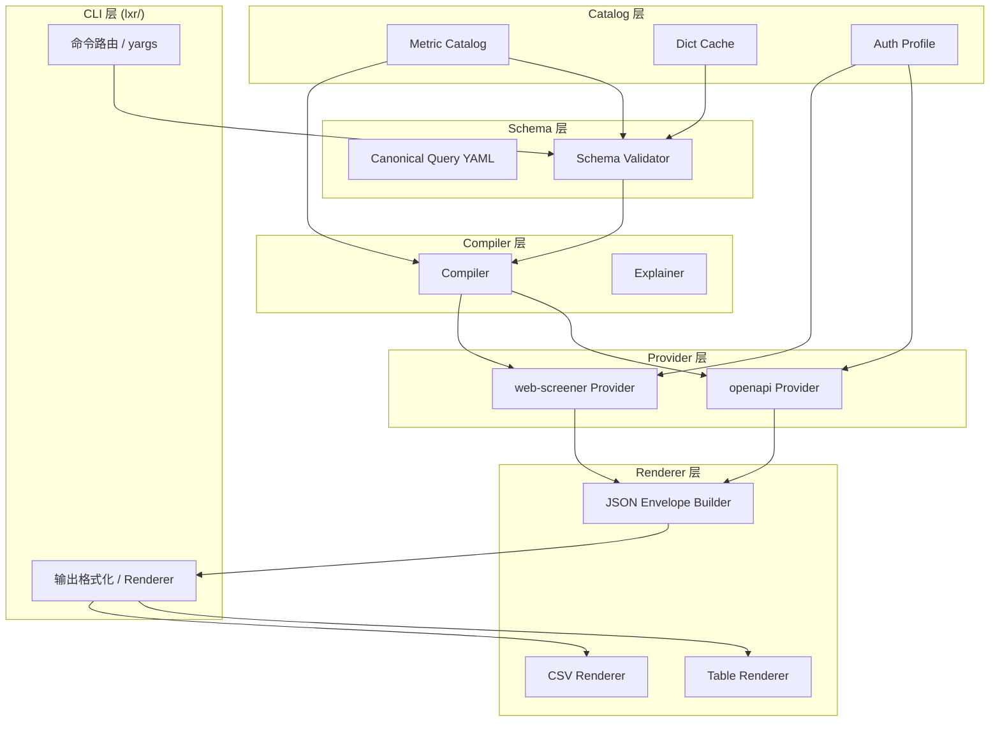

# 设计文档：lxr-cli

## Overview

`lxr` 是一个面向人类和 Agent 双重工作流的命令行工具，封装理杏仁（lixinger.com）股票筛选能力。

核心设计原则：
- **业务语义优先**：用户通过 Canonical Query Schema（YAML）描述筛选意图，不暴露任何 provider 实现细节
- **stdout/stderr 分离**：stdout 只放结果数据，日志/警告/进度一律走 stderr
- **确定性编译**：相同 Canonical Query 输入必须产生完全相同的 Provider Request 输出
- **双后端支持**：openapi（HTTP API）和 web-screener（Playwright 自动化）两个 provider 共享同一套 Canonical Query

工具复用 `skills/lixinger-screener/shared/` 中已实现的核心层（`unified-input.js`、`natural-language.js`、`catalog.js`），在其上构建完整的 CLI 命令树。

---

## Architecture

### 六层架构



### 数据流

```
用户输入 (YAML / --query)
    │
    ▼
[Schema Validator]  ←── Metric Catalog + Dict Cache
    │ CanonicalQuery
    ▼
[Compiler]  ←── Metric Catalog
    │ ProviderRequest
    ▼
[Provider: openapi | web-screener]  ←── Auth Profile
    │ RawResult
    ▼
[JSON Envelope Builder]
    │ Envelope
    ▼
[Renderer: json | table | csv]
    │
    ▼
stdout (结果) / stderr (日志)
```

### 目录结构

基于现有 `skills/lixinger-screener/` 扩展，新增 `lxr/` CLI 入口目录：

```
skills/lixinger-screener/
├── shared/                          # 已实现，复用
│   ├── unified-input.js
│   ├── natural-language.js
│   └── catalog.js
├── browser/                         # 已实现，复用
├── request/                         # 已实现，复用
└── lxr/                             # 新增 CLI 入口
    ├── bin/
    │   └── lxr.js                   # CLI 入口（#!/usr/bin/env node）
    ├── commands/
    │   ├── auth.js                  # auth login/status/logout
    │   ├── dict.js                  # dict sync/list/search/get
    │   ├── metric.js                # metric search/get
    │   ├── screen.js                # screen init/validate/compile/explain/run/import-url
    │   ├── result.js                # result export
    │   └── doctor.js                # doctor
    ├── core/
    │   ├── compiler.js              # Canonical Query → Provider Request
    │   ├── explainer.js             # 自然语言解释筛选条件
    │   ├── validator.js             # Canonical Query Schema 校验
    │   ├── envelope.js              # JSON Envelope 构建
    │   └── renderer.js              # table / csv / json 渲染
    ├── providers/
    │   ├── openapi.js               # openapi provider（复用 request/ 层）
    │   └── web-screener.js          # web-screener provider（复用 browser/ 层）
    ├── auth/
    │   └── profile.js               # Profile 文件读写、优先级链
    ├── dict/
    │   └── cache.js                 # Dict 缓存读写、TTL 判断
    ├── schema/
    │   └── canonical-query.schema.json  # JSON Schema（供 IDE/Agent 校验）
    ├── examples/                    # 示例 Canonical Query YAML 文件
    │   ├── value-screen.yaml
    │   ├── dividend-screen.yaml
    │   ├── growth-screen.yaml
    │   ├── index-constituent-screen.yaml
    │   └── industry-screen.yaml
    └── package.json
```

---

## Components and Interfaces

### 1. CLI 入口（bin/lxr.js）

使用 `yargs` 构建命令树，负责：
- 解析命令行参数
- 检测 TTY 并设置默认输出格式
- 将 stdout/stderr 分离
- 将退出码映射到错误类型

```javascript
// 退出码常量
export const EXIT = {
  OK: 0,
  VALIDATION_ERROR: 2,
  AUTH_ERROR: 3,
  NETWORK_ERROR: 4,
  AMBIGUOUS_DICT: 5,
  PARTIAL_SUCCESS: 6
};
```

### 2. Compiler（core/compiler.js）

将 Canonical Query 转换为 Provider Request，复用 `shared/unified-input.js` 中的 `buildRequestPlanFromUnifiedInput`。

```typescript
interface CompileOptions {
  provider: 'openapi' | 'web-screener';
  catalog: ConditionCatalog;
}

interface CompileResult {
  providerRequest: ProviderRequest;   // openapi body 或 browser filters
  columnSpecs: ColumnSpec[];
  diagnostics: Diagnostic[];
}

function compile(query: CanonicalQuery, options: CompileOptions): CompileResult
```

**映射逻辑**：
- `query.conditions[].metric` + `selectors` → `buildRequestPlanFromUnifiedInput` → `filterList`
- `query.universe.industry` → `ranges.industrySource` + `ranges.industryLevel` + `filterList`
- `query.universe.index` → `ranges.constituentsPerspectiveType` + index filter
- `query.sort` → `sortName` + `sortOrder`

### 3. Validator（core/validator.js）

```typescript
interface ValidationResult {
  valid: boolean;
  errors: Diagnostic[];    // 退出码 2
  warnings: Diagnostic[];  // 退出码 0
}

function validate(query: CanonicalQuery, catalog: ConditionCatalog, dictCache: DictCache): ValidationResult
```

### 4. Provider 接口

两个 provider 实现统一接口：

```typescript
interface ProviderRequest {
  body: object;           // openapi: HTTP body; web-screener: browser filters
  columnSpecs: ColumnSpec[];
}

interface ProviderResult {
  rows: RawRow[];
  total: number;
  latestTime: string;
  latestQuarter: string | null;
}

interface Provider {
  execute(request: ProviderRequest, auth: AuthCredentials): Promise<ProviderResult>
}
```

**openapi provider**（`providers/openapi.js`）：
- 复用 `request/fetch-lixinger-screener.js` 的 HTTP 逻辑
- 支持自动翻页（`fetchAllScreenerRows`）
- 使用 `LXR_TOKEN` 或 cookie 认证

**web-screener provider**（`providers/web-screener.js`）：
- 复用 `browser/main.js` 的 Playwright 逻辑
- 支持 `--headless` 控制
- 支持 `--limit` 截断

### 5. JSON Envelope（core/envelope.js）

```typescript
interface JsonEnvelope {
  ok: boolean;
  schemaVersion: number;        // 当前为 1
  command: string;              // 如 "screen run value-screen.yaml"
  meta: {
    area: string;
    total: number;
    latestTime: string;
    latestQuarter: string | null;
    provider: string;
  };
  rows: object[];
  compiledRequest?: object;     // screen run 时包含
  diagnostics: Diagnostic[];
}

interface Diagnostic {
  level: 'error' | 'warning' | 'info';
  code: string;
  message: string;
  field?: string;
}
```

### 6. Auth Profile（auth/profile.js）

优先级链（高到低）：命令行参数 > 环境变量 > Profile 文件

```typescript
interface AuthCredentials {
  token?: string;           // OpenAPI token
  cookie?: string;          // 网页 session cookie
  username?: string;
  password?: string;
}

// 优先级解析
function resolveAuth(cliArgs: object): AuthCredentials {
  // 1. CLI args: --token, --cookie
  // 2. ENV: LXR_TOKEN, LIXINGER_USERNAME, LIXINGER_PASSWORD
  // 3. Profile file: ~/.lxr/profile.json
}
```

Profile 文件路径：`~/.lxr/profile.json`

```json
{
  "schemaVersion": 1,
  "token": "...",
  "cookie": "...",
  "savedAt": "2024-01-01T00:00:00Z"
}
```

### 7. Dict Cache（dict/cache.js）

```typescript
interface DictCacheFile {
  schemaVersion: number;
  generatedAt: string;      // ISO 8601
  source: string;           // 数据来源 URL
  area: string;             // "cn"
  entityType: string;       // "industry" | "index" | "province" | "exchange"
  items: DictItem[];
}

interface DictItem {
  id: string;
  code: string;
  name: string;
  label: string;
  source: string;           // "sw_2021" | "zjh" 等
  level: number | null;
  parentId: string | null;
  aliases: string[];
  pinyin: string;
}
```

缓存路径：`~/.lxr/dicts/{area}-{entityType}.json`
默认 TTL：24 小时（通过 `generatedAt` 判断）

---

## Data Models

### Canonical Query Schema（YAML）

```yaml
schemaVersion: 1
name: 低估值高股息筛选

universe:
  market: a                          # a | hk | us
  stockBourseTypes:
    include: []                      # 交易所类型白名单
    exclude: []                      # 交易所类型黑名单
  industry:
    source: sw_2021                  # 行业分类标准
    level: three                     # one | two | three
    code: "760102"                   # 行业 code（来自 dict）
  index:
    intersect: "000300"              # 指数成分股交集（来自 dict）
  mutualMarkets:
    include: []                      # 互联互通市场
  multiMarketListedTypes:
    exclude: []                      # 多市场上市类型排除
  province:
    include: []                      # 省份白名单
  flags:
    excludeBlacklist: false
    excludeDelisted: false
    excludeSpecialTreatment: false

conditions:
  - metric: "PE-TTM(扣非)统计值"
    category: "估值"                 # 可选，用于消歧
    selectors:
      - "10年"
      - "分位点%"
    between: [0, 30]                 # 等价于 gte: 0, lte: 30

  - metric: "股息率"
    gte: 2

  - metric: "上市日期"
    lte: "2015-01-01"

sort:
  metric: "股息率"
  order: desc                        # asc | desc

output:
  fields:                            # 输出列（空则输出所有 conditions 列）
    - "股票代码"
    - "公司名称"
    - "股息率"
    - "PE-TTM(扣非)统计值"
  format: table                      # json | table | csv
```

### Canonical Query 与 unified-input.json 的映射关系

| Canonical Query 字段 | unified-input.json 字段 | 说明 |
|---|---|---|
| `conditions[].metric` | `conditions[].metric` | 直接映射 |
| `conditions[].selectors` | `conditions[].selectors` | 直接映射 |
| `conditions[].between` | `conditions[].min` + `conditions[].max` | 展开 |
| `conditions[].gte` | `conditions[].min` | 直接映射 |
| `conditions[].lte` | `conditions[].max` | 直接映射 |
| `universe.market` | `ranges.market` | 直接映射 |
| `universe.industry.source` | `industrySource` | 直接映射 |
| `universe.industry.level` | `industryLevel` | 直接映射 |
| `sort.metric` | `sort.metric` | 直接映射 |
| `sort.order` | `sort.order` | 直接映射 |
| `output.format` | — | CLI 层处理，不传入 unified-input |

### Provider Request（openapi body）

由 `buildRequestPlanFromUnifiedInput` 生成，结构如下：

```json
{
  "areaCode": "cn",
  "ranges": {
    "market": "a",
    "stockBourseTypes": [],
    "mutualMarkets": { "selectedMutualMarkets": [], "selectType": "include" },
    "multiMarketListedType": { "selectedMultiMarketListedTypes": [], "selectType": "include" },
    "excludeBlacklist": false,
    "excludeDelisted": false,
    "excludeBourseType": false,
    "excludeSpecialTreatment": false,
    "constituentsPerspectiveType": "history",
    "specialTreatmentOnly": false
  },
  "filterList": [
    { "id": "d_pe_ttm.y10.cvpos", "value": "all", "date": "latest", "min": 0, "max": 0.3 }
  ],
  "customFilterList": [],
  "industrySource": "sw_2021",
  "industryLevel": "three",
  "sortName": "pm.latest.d_pe_ttm.y10.cvpos",
  "sortOrder": "desc",
  "pageIndex": 0,
  "pageSize": 100
}
```

### JSON Envelope（完整示例）

```json
{
  "ok": true,
  "schemaVersion": 1,
  "command": "screen run value-screen.yaml",
  "meta": {
    "area": "cn",
    "total": 42,
    "latestTime": "2024-01-15",
    "latestQuarter": "2023-09-30",
    "provider": "openapi"
  },
  "rows": [
    {
      "stockCode": "600519",
      "exchange": "sh",
      "name": "贵州茅台",
      "industry": "白酒",
      "股息率": "3.20%",
      "PE-TTM(扣非)统计值10年分位点%": "25.00"
    }
  ],
  "compiledRequest": { "areaCode": "cn", "filterList": [] },
  "diagnostics": []
}
```

---

## Correctness Properties

*A property is a characteristic or behavior that should hold true across all valid executions of a system — essentially, a formal statement about what the system should do. Properties serve as the bridge between human-readable specifications and machine-verifiable correctness guarantees.*

### Property 1: 未知命令返回退出码 2

*For any* string that is not a valid `lxr` subcommand, invoking the CLI with that string as the command should result in exit code 2 and output to stderr.

**Validates: Requirements 1.3**

---

### Property 2: JSON Envelope 结构完整性

*For any* execution result (success or failure), the JSON envelope produced by `envelope.js` must contain all required fields: `ok`, `schemaVersion`, `command`, `meta`, `rows`, `diagnostics`.

**Validates: Requirements 2.7**

---

### Property 3: ok=false 时 diagnostics 非空

*For any* error scenario where `ok` is `false`, the `diagnostics` array in the JSON envelope must contain at least one entry with `level: "error"`.

**Validates: Requirements 2.8**

---

### Property 4: 退出码与错误类型一一对应

*For any* error thrown by the CLI, the exit code must match the error category: validation errors → 2, auth errors → 3, network/provider errors → 4, ambiguous dict → 5, partial success → 6, success → 0.

**Validates: Requirements 3.1, 3.2, 3.3, 3.4, 3.5, 3.6**

---

### Property 5: 认证优先级链

*For any* combination of CLI argument, environment variable, and profile file providing auth credentials, the resolved credentials must use the highest-priority source (CLI arg > env var > profile file). If a higher-priority source provides a value, lower-priority sources must be ignored for that field.

**Validates: Requirements 4.4**

---

### Property 6: Dict 缓存文件结构完整性

*For any* dict sync result, the generated cache file must contain all required top-level fields (`schemaVersion`, `generatedAt`, `source`, `area`, `entityType`, `items`), and every item in `items` must contain all required fields (`id`, `code`, `name`, `label`, `source`, `level`, `parentId`, `aliases`, `pinyin`).

**Validates: Requirements 5.3, 5.4**

---

### Property 7: Dict 缓存 TTL 判断

*For any* cache file with a `generatedAt` timestamp, the `isExpired` function must return `true` if and only if the elapsed time since `generatedAt` exceeds the configured TTL (default 24 hours).

**Validates: Requirements 5.8**

---

### Property 8: 无效指标名触发校验错误

*For any* Canonical Query containing a `conditions[].metric` value that does not exist in the loaded Catalog, the validator must return at least one error diagnostic referencing that metric name.

**Validates: Requirements 7.6**

---

### Property 9: Compiler 确定性

*For any* valid Canonical Query, compiling it twice with the same Catalog must produce byte-for-byte identical Provider Request output. No randomness, timestamps, or ordering variation is permitted in the compiled output.

**Validates: Requirements 9.4**

---

### Property 10: Compiler 指标映射正确性

*For any* condition in a Canonical Query where `metric` exists in the Catalog, the compiled `filterList` must contain exactly one entry whose `id` matches the Catalog entry's `requestId` (after stripping `.latest` suffix).

**Validates: Requirements 9.1**

---

### Property 11: CSV 输出 RFC 4180 合规性

*For any* non-empty rows array, the CSV renderer must produce output where: (a) the first line contains all column headers, (b) every subsequent line has the same number of comma-separated fields as the header line, and (c) fields containing commas or double-quotes are properly quoted per RFC 4180.

**Validates: Requirements 11.4**

---

### Property 12: 渲染器输出包含所有列标题

*For any* rows array and format (table or csv), the renderer output must contain every column name that appears as a key in the rows objects.

**Validates: Requirements 2.4, 2.5**

---

## Error Handling

### 错误分类与退出码

| 错误类型 | 退出码 | 示例 |
|---|---|---|
| 输入校验失败 | 2 | metric 不在 catalog、YAML 格式错误、参数缺失 |
| 认证失败 | 3 | token 无效、cookie 过期、凭据缺失 |
| 网络/Provider 失败 | 4 | HTTP 超时、Playwright 操作失败、HTTP 4xx/5xx |
| 字典歧义 | 5 | 搜索词匹配多个结果且无法自动消歧 |
| 部分成功 | 6 | 分页抓取中途失败但已有部分数据 |

### 错误传播规则

1. 所有错误消息写入 stderr，不写入 stdout
2. 当 `--format json` 时，错误同时写入 JSON Envelope 的 `diagnostics` 字段，`ok` 设为 `false`
3. Provider 层抛出的错误统一包装为带 `exitCode` 属性的 `LxrError` 类
4. Compiler 层的警告（如不支持的字段）不阻断执行，写入 `diagnostics` 并继续

### LxrError 类

```javascript
class LxrError extends Error {
  constructor(message, exitCode, code) {
    super(message);
    this.exitCode = exitCode;  // 2 | 3 | 4 | 5 | 6
    this.code = code;          // 如 "METRIC_NOT_FOUND"
  }
}
```

---

## Testing Strategy

### 双轨测试方法

单元测试和属性测试互补，共同保证正确性：
- **单元测试**：验证具体示例、边界条件、集成点
- **属性测试**：验证对所有输入成立的普遍性质

### 属性测试配置

使用 `fast-check` 库（JavaScript 属性测试标准库）。

每个属性测试最少运行 100 次迭代（`numRuns: 100`）。

每个属性测试必须包含注释标注对应的设计属性：
```javascript
// Feature: lxr-cli, Property 9: Compiler 确定性
```

### 属性测试实现

```javascript
import fc from 'fast-check';
import { compile } from '../core/compiler.js';
import { buildEnvelope } from '../core/envelope.js';
import { toCsv } from '../core/renderer.js';
import { isExpired } from '../dict/cache.js';
import { resolveAuth } from '../auth/profile.js';
import { validate } from '../core/validator.js';

// Feature: lxr-cli, Property 9: Compiler 确定性
test('compiler is deterministic', () => {
  fc.assert(fc.property(
    arbitraryCanonicalQuery(),
    (query) => {
      const r1 = compile(query, { provider: 'openapi', catalog });
      const r2 = compile(query, { provider: 'openapi', catalog });
      expect(JSON.stringify(r1.providerRequest)).toBe(JSON.stringify(r2.providerRequest));
    }
  ), { numRuns: 100 });
});

// Feature: lxr-cli, Property 2: JSON Envelope 结构完整性
test('envelope always contains required fields', () => {
  fc.assert(fc.property(
    arbitraryEnvelopeInput(),
    (input) => {
      const env = buildEnvelope(input);
      expect(env).toHaveProperty('ok');
      expect(env).toHaveProperty('schemaVersion');
      expect(env).toHaveProperty('command');
      expect(env).toHaveProperty('meta');
      expect(env).toHaveProperty('rows');
      expect(env).toHaveProperty('diagnostics');
    }
  ), { numRuns: 100 });
});

// Feature: lxr-cli, Property 3: ok=false 时 diagnostics 非空
test('ok=false implies non-empty diagnostics', () => {
  fc.assert(fc.property(
    arbitraryErrorEnvelopeInput(),
    (input) => {
      const env = buildEnvelope({ ...input, ok: false });
      expect(env.ok).toBe(false);
      expect(env.diagnostics.length).toBeGreaterThan(0);
      expect(env.diagnostics.some(d => d.level === 'error')).toBe(true);
    }
  ), { numRuns: 100 });
});

// Feature: lxr-cli, Property 7: Dict 缓存 TTL 判断
test('isExpired correctly identifies stale cache', () => {
  fc.assert(fc.property(
    fc.integer({ min: 0, max: 200 }),  // hours ago
    (hoursAgo) => {
      const generatedAt = new Date(Date.now() - hoursAgo * 3600 * 1000).toISOString();
      const expired = isExpired({ generatedAt }, 24);
      expect(expired).toBe(hoursAgo > 24);
    }
  ), { numRuns: 100 });
});

// Feature: lxr-cli, Property 11: CSV RFC 4180 合规性
test('csv renderer produces RFC 4180 compliant output', () => {
  fc.assert(fc.property(
    fc.array(arbitraryRow(), { minLength: 1, maxLength: 50 }),
    (rows) => {
      const csv = toCsv(rows);
      const lines = csv.split('\n');
      const headerCount = lines[0].split(',').length;
      // Every line has same field count (accounting for quoted commas)
      for (const line of lines.slice(1)) {
        expect(parseCSVLine(line).length).toBe(headerCount);
      }
    }
  ), { numRuns: 100 });
});

// Feature: lxr-cli, Property 10: Compiler 指标映射正确性
test('compiler maps metric to correct provider field', () => {
  fc.assert(fc.property(
    arbitraryConditionFromCatalog(catalog),
    (condition) => {
      const query = { schemaVersion: 1, conditions: [condition] };
      const result = compile(query, { provider: 'openapi', catalog });
      const entry = catalog.metrics.find(m => m.metric === condition.metric);
      const expectedId = stripLatestSuffix(entry.formulaIdExample);
      expect(result.providerRequest.filterList[0].id).toBe(expectedId);
    }
  ), { numRuns: 100 });
});

// Feature: lxr-cli, Property 8: 无效指标名触发校验错误
test('unknown metric triggers validation error', () => {
  fc.assert(fc.property(
    fc.string({ minLength: 1 }).filter(s => !catalog.metrics.some(m => m.metric === s)),
    (unknownMetric) => {
      const query = { schemaVersion: 1, conditions: [{ metric: unknownMetric, gte: 0 }] };
      const result = validate(query, catalog, {});
      expect(result.valid).toBe(false);
      expect(result.errors.some(e => e.message.includes(unknownMetric))).toBe(true);
    }
  ), { numRuns: 100 });
});

// Feature: lxr-cli, Property 5: 认证优先级链
test('auth resolution respects priority chain', () => {
  fc.assert(fc.property(
    fc.record({
      cliToken: fc.option(fc.string({ minLength: 1 })),
      envToken: fc.option(fc.string({ minLength: 1 })),
      profileToken: fc.option(fc.string({ minLength: 1 }))
    }),
    ({ cliToken, envToken, profileToken }) => {
      const auth = resolveAuth({ cliToken, envToken, profileToken });
      if (cliToken) expect(auth.token).toBe(cliToken);
      else if (envToken) expect(auth.token).toBe(envToken);
      else if (profileToken) expect(auth.token).toBe(profileToken);
    }
  ), { numRuns: 100 });
});
```

### 单元测试覆盖点

单元测试聚焦于具体示例和边界条件，避免与属性测试重复：

- **Compiler**：golden tests — 对 5 个示例 YAML 文件的 `screen compile` 输出做快照测试
- **Validator**：具体错误消息格式、警告 vs 错误分类
- **Auth**：`auth login` 写入 profile 文件、`auth logout` 清除文件
- **Dict**：`dict search` 模糊匹配算法（拼音、别名）
- **Renderer**：空 rows 数组的边界处理
- **Provider**：openapi 自动翻页逻辑（mock HTTP）

### Golden Tests（编译快照）

对 `examples/` 目录下 5 个示例文件，验证 `screen compile` 输出的确定性：

```
examples/value-screen.yaml          → golden/value-screen.openapi.json
examples/dividend-screen.yaml       → golden/dividend-screen.openapi.json
examples/growth-screen.yaml         → golden/growth-screen.openapi.json
examples/index-constituent-screen.yaml → golden/index-constituent-screen.openapi.json
examples/industry-screen.yaml       → golden/industry-screen.openapi.json
```

### Smoke Tests（全链路验证）

使用固定 screener URL 跑全链路，需要真实网络和认证：

```bash
# 需要 LXR_TOKEN 或 LIXINGER_USERNAME/PASSWORD
lxr screen run examples/value-screen.yaml --provider openapi
lxr screen run examples/value-screen.yaml --provider web-screener
```

Smoke test 验证：
- 退出码为 0
- stdout 输出合法 JSON
- `rows` 数组非空
- `meta.total` > 0
