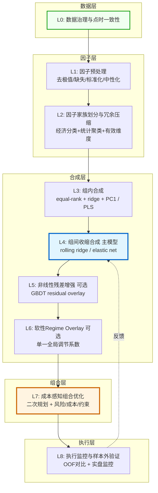
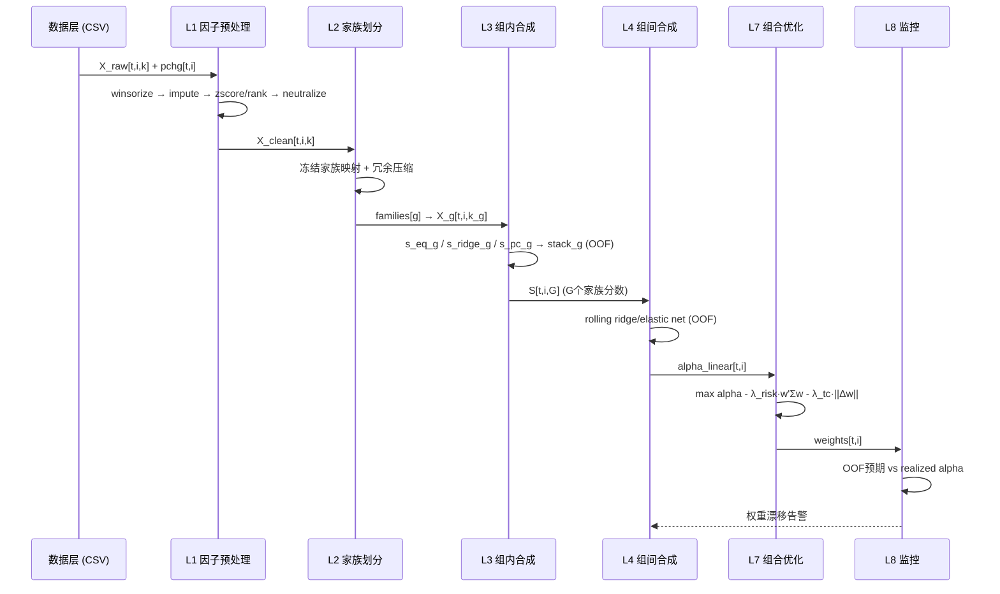
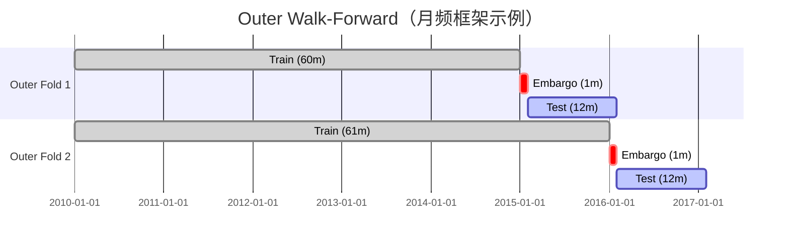

# Design Document: 弱因子组合量化策略 (Weak Factor Portfolio Strategy)

## Overview

弱因子组合量化策略是一套成熟的、可生产的A股股票横截面因子合成框架，专门用于处理100-500个弱因子的合成与组合构建。该策略采用"分层收缩合成 + OOF叠加 + 成本感知组合优化"的核心理念，将因子合成层与组合构建层彻底分离，通过收缩方法而非复杂模型来处理高维弱信号，并显式考虑交易成本、风险约束和容量限制。

核心设计哲学：**Hierarchical Shrinkage Ensemble with Optimizer-Aware Alpha**

该策略适用于周频或月频选股，支持long-only和market-neutral两种模式，强调点时一致性(point-in-time consistency)、样本外验证(out-of-sample validation)和成本感知优化(cost-aware optimization)。

本设计文档描述 **v2 目标架构**，对应技术方案 `弱因子组合量化策略技术方案.md` 中的终极方案。现有 `weak_factor_portfolio.py` 为 v1 实现，采用了技术方案中明确不推荐的设计（固定三路融合、IC top-k 激活、因子层止损等），v2 将对其进行系统性重构。

## Architecture

整体架构采用8层设计，从数据治理到执行监控形成完整闭环：



### 主要数据流



### 三层职责边界

| 层次 | 输入 | 输出 | 禁止越界 |
|------|------|------|----------|
| 因子合成层 (L1-L6) | 原始因子 X[t,i,k] | alpha_score s[t,i] | 不输出仓位，不做止损 |
| 组合构建层 (L7) | alpha_score + 风险/成本模型 | 权重 w[t,i] | 不修改 alpha 分数 |
| 执行监控层 (L8) | 权重 + 实际收益 | 监控报告 + 反馈 | 不反向修改历史权重 |

## Data Schema

### 3.1 数据文件

- **文件路径**：`skills/autoresearch_ml_joinquant_factor_v2/train_merged_all.csv`
- **总行数**：约 616,117 行
- **总列数**：263 列
- **时间范围**：2009-12-31 至 2025-05-23
- **时间间隔**：中位数 7 天（周频面板）
- **每期股票数**：293 ~ 949，均值约 781

### 3.2 列结构

| 列名 | 类型 | 说明 |
|------|------|------|
| `Unnamed: 0` | string | 股票代码，如 `002001.XSHE`，进入 pipeline 前重命名为 `stock_id` |
| `date` | string/date | 截面日期，如 `2009-12-31`，格式 `YYYY-MM-DD` |
| `pchg` | float | 下期涨跌幅（预测标签），已对齐为当前项目真实标签字段 |
| 其余 260 列 | float | 因子值，按家族分组（见 3.3） |

### 3.3 因子家族映射

当前项目冻结以下 9 个家族作为第一阶段实验底板（来源：notebook 分组）：

| 家族名 | 因子数 | 经济含义 | 典型因子 |
|--------|--------|----------|----------|
| `basics` | 37 | 财务基础指标 | `administration_expense_ttm`, `EBIT`, `market_cap`, `total_assets` |
| `emotion` | 36 | 情绪/量价指标 | `AR`, `TVSTD20`, `VOL5`, `turnover_volatility`, `BR` |
| `growth` | 9 | 成长指标 | `net_profit_growth_rate`, `operating_revenue_growth_rate`, `eps_growth` |
| `momentum` | 34 | 动量指标 | `BIAS10`, `CCI10`, `ROC120`, `Price1M`, `Price3M` |
| `pershare` | 15 | 每股指标 | `eps_ttm`, `net_asset_per_share`, `cash_flow_per_share` |
| `quality` | 71 | 质量指标 | `roa_ttm`, `roe_ttm`, `current_ratio`, `inventory_turnover_rate` |
| `risk` | 12 | 风险指标 | `Kurtosis120`, `Variance20`, `sharpe_ratio_60`, `beta_60` |
| `style` | 30 | 风格因子 | `beta`, `liquidity`, `natural_log_of_market_cap`, `momentum` |
| `technical` | 16 | 技术指标 | `boll_up`, `EMA5`, `EMAC12`, `MAC20`, `RSI6` |

**合计**：260 个唯一因子，覆盖 CSV 中除 `stock_id/date/pchg` 外的全部列。

### 3.4 标签定义

```
pchg[t,i] = 股票 i 在截面日期 t 到下一个截面日期的涨跌幅（原始收益）
```

**v2 推荐处理**：在 L1 预处理阶段，将 `pchg` 转换为超额收益（行业/风格中性后的残差收益），作为 L4 组间合成的训练标签 `y^{(h*)}`。第一阶段实验可直接使用原始 `pchg`，后续迭代再引入中性化标签。

### 3.5 数据张量定义

```
X[t, i, k]      : 日期 t、股票 i、因子 k 的值（点时可得）
y[t+1, i]       : 从 t 到下一再平衡日的超额收益（标签）
B[t, i, m]      : 风险暴露（行业、ln市值、beta、残差波动、流动性）
tradable[t, i]  : 日期 t 股票 i 是否可交易（排除停牌/涨跌停/ST/新股）
cost[t, i]      : 交易成本估计（佣金+税费+冲击）
```

### 3.6 点时一致性约束

- 财务因子按**实际披露日**生效，不按报告期末提前生效
- 股票池使用**当时可得成分**，不用当前成分回溯
- 停牌、涨跌停、ST、退市整理、新股冷启动（上市 < 60 个交易日）需过滤
- 任何使用全样本均值/标准差的预处理步骤均禁止

## Component Design

### 4.1 L0：数据治理与点时一致性

**职责**：确保所有输入数据满足点时一致性，构建可信的实验底板。

**输入**：`train_merged_all.csv`（原始面板数据）

**输出**：`FactorPanel`（清洁的点时一致面板，含 stock_id / date / factors / pchg / tradable_mask）

**核心算法**：

```pascal
PROCEDURE build_pit_panel(raw_csv_path)
  INPUT: CSV 文件路径
  OUTPUT: FactorPanel

  SEQUENCE
    df ← load_csv(raw_csv_path)
    df ← rename_column("Unnamed: 0", "stock_id")
    df ← parse_dates("date")
    df ← sort_by(["date", "stock_id"])

    // 构建可交易掩码
    tradable ← compute_tradable_mask(df)
      // 排除: ST/*ST, 停牌, 涨跌停一字板, 新股冷启动(<60交易日), 退市整理

    // 财务因子时滞校验（若有披露日字段）
    df ← apply_disclosure_lag(df, financial_cols)

    // 标签对齐：pchg 已是下期收益，无需 shift
    // 但需确认无未来信息泄漏
    ASSERT all(df["pchg"] == next_period_return(df))

    RETURN FactorPanel(df, tradable_mask=tradable)
  END SEQUENCE
END PROCEDURE
```

**关键参数**：
- `new_stock_cooldown_days = 60`：新股冷启动过滤天数
- `st_filter = True`：过滤 ST/*ST 股票
- `suspension_filter = True`：过滤停牌股票

---

### 4.2 L1：因子预处理

**职责**：在每个再平衡日对横截面执行去极值、缺失处理、标准化、风格中性化。

**输入**：`X_raw[t, i, k]`（原始因子截面）

**输出**：`X_clean[t, i, k]`（清洗后因子，双轨表示：rank + zscore）

**预处理顺序**（每个再平衡日独立执行）：

```pascal
PROCEDURE preprocess_cross_section(X_raw_t, risk_exposures_t)
  INPUT: X_raw_t (N×K 截面矩阵), risk_exposures_t (N×M 风险暴露)
  OUTPUT: X_clean_t (N×K 清洗后因子)

  SEQUENCE
    // Step 1: 去极值 (robust winsor)
    FOR each factor k DO
      median_k ← median(X_raw_t[:, k])
      mad_k ← median(|X_raw_t[:, k] - median_k|)
      X_t[:, k] ← clip(X_raw_t[:, k], median_k - 5*mad_k, median_k + 5*mad_k)
    END FOR

    // Step 2: 缺失处理
    FOR each factor k DO
      IF k IN financial_factors THEN
        X_t[:, k] ← fillna_by_industry_median(X_t[:, k])
      ELSE IF k IN microstructure_factors THEN
        X_t[:, k] ← fillna_forward(X_t[:, k])  // 前推最近可得值
      END IF
      // 极度稀疏因子（缺失率 > 30%）降权或移除
    END FOR

    // Step 3: 双轨标准化
    X_rank_t[:, k] ← rank(X_t[:, k]) / (N+1) - 0.5   // 稳健 rank 表示
    X_zscore_t[:, k] ← (X_t[:, k] - median) / (MAD + eps)  // 稳健 zscore

    // Step 4: 风格中性化 (横截面 WLS)
    // 对每个因子单独回归，右侧使用同一组联合风险暴露
    // 权重: sqrt(float_mcap) clip 后
    FOR each factor k DO
      gamma_k ← WLS_solve(X_rank_t[:, k] ~ B_t, weights=sqrt_mcap)
      X_neu_t[:, k] ← X_rank_t[:, k] - B_t @ gamma_k
    END FOR

    RETURN X_neu_t
  END SEQUENCE
END PROCEDURE
```

**风格中性化暴露集合**（`B_t`）：
- 行业哑变量（申万一级，`K-1` 个 + 截距，或 `K` 个无截距，**必须全框架统一**）
- `ln(float_mcap)`：对数流通市值
- `beta`：市场 beta（rolling 60 日，估计窗口必须严格因果，只使用历史数据）
- `residual_vol`：残差波动率（rolling 60 日，同上）
- `liquidity`：流动性（换手率 rolling 均值）

**中性化实现规范**（来自技术方案 6.5 节）：
- **禁止逐步回归**：不要按"先市值、再行业、再 beta"的顺序逐步回归，顺序会引入路径依赖。必须对每个因子单独回归，但右侧使用**同一组联合风险暴露**。
- **样本极少行业处理**：对样本数极少的行业，使用行业合并、ridge 回归或行业内 shrinkage，避免回归矩阵近奇异。
- **跨时间估计暴露的因果性**：`beta`、`residual_vol` 等 rolling 估计的暴露，其估计窗口必须严格因果（只使用 `date < t` 的数据）。行业哑变量和当日市值是点时可得的，不需要额外 OOF。
- **WLS 权重**：默认使用 `sqrt(float_mcap)` clip 后作为权重，避免极端大盘股主导。

**关键参数**：
- `winsor_mad_multiplier = 5.0`
- `missing_rate_threshold = 0.30`（超过此比例的因子降权）
- `neutralization_exposures = ["industry", "ln_mcap", "beta", "residual_vol", "liquidity"]`
- `industry_dummy_style = "K-1+intercept"`（全框架统一，不可混用）

---

### 4.3 L2：因子家族划分与冗余压缩

**职责**：将 260 个因子按经济含义分组，并在组内压缩冗余，评估有效维度。

**输入**：`X_clean[t, i, k]`（清洗后因子）

**输出**：`FamilyMap`（因子→家族映射）+ `EffectiveDimension`（各家族有效维度）

**核心算法**：

```pascal
PROCEDURE build_family_map(X_clean, economic_taxonomy)
  INPUT: X_clean (T×N×K), economic_taxonomy (K→family 映射)
  OUTPUT: FamilyMap, EffectiveDimension

  SEQUENCE
    // Phase 1: 经济分类优先（冻结初始9家族）
    family_map ← economic_taxonomy  // 直接使用 notebook 提供的分组

    // Phase 2: 统计冗余检查（组内）
    FOR each family g DO
      corr_matrix_g ← rolling_rank_ic_correlation(X_clean[:, :, g])
      eigenvalues_g ← eigen(corr_matrix_g)

      // 有效维度
      n_eff_g ← (sum(eigenvalues_g))^2 / sum(eigenvalues_g^2)

      // 高相关因子聚类（相关性 > 0.8）
      clusters_g ← hierarchical_cluster(corr_matrix_g, threshold=0.8)
      family_map[g].clusters ← clusters_g
      family_map[g].n_eff ← n_eff_g
    END FOR

    // Phase 3: 因子准入/淘汰（三段式）
    // shadow_pool → 观察期 → 正式纳入/淘汰
    // 淘汰条件: 连续4~6个评估窗口 OOF 增量贡献为负

    RETURN family_map, {g: family_map[g].n_eff for g in families}
  END SEQUENCE
END PROCEDURE
```

**有效维度公式**：
```
n_eff = (Σλ_j)² / Σλ_j²
```
其中 `λ_j` 是家族内截面 rank IC 相关矩阵的特征值。

**家族更新节奏**：季度或半年级别更新，不做日更或月更。

---

### 4.4 L3：组内合成

**职责**：对每个家族生成一个更稳定的代表分数 `s_g`，通过 OOF 叠加三类子分数。

**输入**：`X_g[t, i, k_g]`（家族 g 的因子截面）

**输出**：`s_g[t, i]`（家族 g 的合成分数，OOF 预测）

**核心算法**：

```pascal
PROCEDURE intra_family_synthesis_oof(X_g, y_decision, train_range)
  INPUT: X_g (家族因子), y_decision (决策 horizon 标签), train_range
  OUTPUT: s_g_oof (OOF 家族分数)

  SEQUENCE
    FOR each outer_fold IN walk_forward_splits(train_range) DO
      X_fold ← X_g[outer_fold.train]
      y_fold ← y_decision[outer_fold.train]

      // 子分数 1: 稳健基线 (rank 等权平均)
      s_eq_g ← mean_rank_score(X_fold)

      // 子分数 2: 监督收缩 (rolling ridge)
      s_ridge_g ← rolling_ridge_predict(X_fold, y_fold)

      // 子分数 3: 去冗余 (PC1，含符号锚定)
      s_pc_g ← pc1_score_with_sign_anchor(X_fold, anchor=s_eq_g)
        // 符号锚定: IF corr(PC1, s_eq_g) < 0 THEN PC1 *= -1

      // OOF 叠加 (非负 ridge，权重由 OOF 决定)
      stack_weights_g ← fit_nonneg_ridge(
        features=[s_eq_g, s_ridge_g, s_pc_g],
        target=y_fold,
        method="oof_inner_loop"
      )

      // 在 validation fold 上预测
      s_g_oof[outer_fold.test] ← predict(stack_weights_g, X_g[outer_fold.test])
    END FOR

    RETURN s_g_oof
  END SEQUENCE
END PROCEDURE
```

**PC1 失稳处理**：
- 若第一特征值与第二特征值接近（比值 < 1.5），降权 PC1
- 若 PC1 与上期相关性 < 0.7，回退到 `equal-rank + ridge`

**关键参数**：
- `stack_method = "nonneg_ridge"`（非负 ridge，防止权重翻正翻负）
- `pc1_stability_threshold = 0.7`（PC1 跨期相关性下限）
- `eigenvalue_ratio_threshold = 1.5`（PC1 稳定性判断）

---

### 4.5 L4：组间收缩合成（主模型）

**职责**：将 G 个家族分数通过 rolling ridge / elastic net 合成最终线性 alpha，是整套方案的核心。

**输入**：`S[t, i, G]`（G 个家族的 OOF 分数矩阵）+ `y^{(h*)}[t, i]`（决策 horizon 标签）

**输出**：`alpha_linear[t, i]`（线性 alpha 分数）

**核心算法**：

```pascal
PROCEDURE cross_family_synthesis_oof(S_oof, y_decision, config)
  INPUT: S_oof (T×N×G OOF 家族分数), y_decision (标签), config
  OUTPUT: alpha_linear_oof (OOF 线性 alpha)

  SEQUENCE
    FOR each outer_fold IN walk_forward_splits(train_range) DO
      S_train ← S_oof[outer_fold.train]  // 必须是 OOF 分数，非样本内拟合值
      y_train ← y_decision[outer_fold.train]

      // Inner loop: 超参数选择
      best_lambda ← inner_loop_tune(
        S_train, y_train,
        search_space={
          "alpha_reg": [0.001, 0.01, 0.1, 1.0, 10.0],
          "l1_ratio": [0.0, 0.1, 0.5]  // 0.0=纯ridge, >0=elastic net
        }
      )

      // 主模型: rolling ridge / elastic net
      // min_beta ||y - S̃·beta||² + lambda_ridge·||beta||² + lambda_lasso·||beta||₁
      beta_t ← fit_elastic_net(S_train, y_train, **best_lambda)

      // 权重约束
      beta_t ← apply_weight_constraints(beta_t,
        max_single_family=0.4,   // 单家族上限
        allow_negative=True,     // 轻度允许负权
        smooth_with_prev=True    // 时间平滑
      )

      // 在 test fold 上预测
      alpha_linear_oof[outer_fold.test] ← S_oof[outer_fold.test] @ beta_t
    END FOR

    RETURN alpha_linear_oof
  END SEQUENCE
END PROCEDURE
```

**最终线性 alpha**：
```
alpha_linear[t, i] = Σ_g β_{t,g} · s_g[t, i]
```

**为什么用收缩而非 top-k 激活**：
- 收缩法对高相关信号更稳，对 OOS 更友好
- 不依赖阈值，不追噪声
- 权重平滑，换手可控

**关键参数**：
- `default_model = "ridge"`（家族数少时）/ `"elastic_net"`（家族数多时）
- `lambda_ridge_grid = [0.001, 0.01, 0.1, 1.0, 10.0]`
- `l1_ratio_grid = [0.0, 0.1, 0.5]`
- `max_single_family_weight = 0.4`
- `weight_smoothing_halflife = 4`（再平衡周期数）

**可选增强：Bayesian shrinkage**（非默认）：
- 当家族数较多且需要更强先验约束时，可使用 Bayesian shrinkage 替代 elastic net。
- 默认主模型仍为 ridge / elastic net，Bayesian shrinkage 作为研究增强选项。

**协方差惩罚是可选增强，不是默认项**（来自技术方案 9.2 节）：
- 直接在原空间加入 `β'Ωβ` 惩罚项**不是默认推荐**，因为可能额外惩罚高方差但高信息量的方向，且当 Ω 近似单位阵时与 ridge 高度重叠。
- 如需协方差感知收缩，推荐优先在 **PCA/whitened 空间**做 ridge，或对 `S` 先做正交化再施加简单收缩。
- 默认主模型：ridge / elastic net；可选增强：正交化空间下的 covariance-aware shrinkage。

---

### 4.6 L5：非线性残差增强（可选）

**职责**：用 GBDT 拟合线性主模型的残差，提供非线性边际增益。

**输入**：`alpha_linear_oof[t, i]`（线性 alpha OOF）+ `X_clean[t, i, k]`（清洗后因子）

**输出**：`alpha_final[t, i] = alpha_linear + η · alpha_nonlinear`

**核心算法**：

```pascal
PROCEDURE residual_overlay_oof(alpha_linear_oof, y_decision, X_clean, config)
  INPUT: alpha_linear_oof, y_decision, X_clean
  OUTPUT: alpha_nl_oof, eta_selected

  SEQUENCE
    // 计算残差
    r_residual ← y_decision - alpha_linear_oof

    // 用 GBDT 拟合残差（OOF）
    alpha_nl_oof ← fit_gbdt_oof(X_clean, r_residual,
      params={max_depth: 4, n_estimators: 100, subsample: 0.8}
    )

    // Inner loop 选择 eta
    eta_grid ← [0, 0.05, 0.10, 0.20, 0.30]
    best_eta ← inner_loop_select_eta(
      alpha_linear_oof, alpha_nl_oof, y_decision,
      metric="oof_rank_ic_after_cost",
      grid=eta_grid
    )
    // eta=0 必须永远保留为合法选项

    // 准入条件检查
    IF NOT passes_overlay_gate(alpha_nl_oof, alpha_linear_oof, y_decision) THEN
      best_eta ← 0  // 不启用非线性 overlay
    END IF

    RETURN alpha_nl_oof, best_eta
  END SEQUENCE
END PROCEDURE
```

**准入条件**（全部满足才允许 η > 0）：
1. OOF 成本后 IR 相比 η=0 有稳定提升
2. 提升在多数 outer folds 上方向一致
3. block-bootstrap 检验支持增益为正
4. 换手上升在可接受范围内

**第一阶段默认关闭**，等线性主线稳定后再逐步打开。

---

### 4.7 L6：软性 Regime Overlay（可选）

**职责**：基于可实时观测的市场状态指标，对 alpha 做轻量软调节，不做硬切换。

**输入**：`alpha[t, i]`（合成 alpha）+ regime 指标

**输出**：`alpha'[t, i] = adj_t · alpha[t, i]`

**核心算法**：

```pascal
PROCEDURE soft_regime_overlay(alpha, regime_indicators, model_state)
  INPUT: alpha (T×N), regime_indicators (T×R)
  OUTPUT: alpha_adjusted (T×N)

  SEQUENCE
    // Step 1: 压缩 regime 指标为 1~2 个状态变量
    z_regime ← pca_compress(regime_indicators, n_components=1)

    // Step 2: 单调低自由度映射
    adj_t ← clip(a + b * z_regime_t, lower=0.9, upper=1.1)
    // 参数 a, b 在 inner loop 中选择
    // 默认窄区间 [0.9, 1.1]，样本外验证后才放宽到 [0.75, 1.25]

    alpha_adjusted ← alpha * adj_t

    RETURN alpha_adjusted
  END SEQUENCE
END PROCEDURE
```

**可用 regime 指标**：
- 市场波动率（VIX 类）
- 横截面收益离散度
- 横截面 alpha breadth
- 风格拥挤度代理变量

**第一阶段默认关闭**。

---

### 4.8 L7：成本感知组合优化

**职责**：将 alpha 分数转换为真实持仓权重，显式考虑风险、成本和约束。

**输入**：`alpha[t, i]`（合成 alpha）+ 风险模型 + 成本模型 + 约束集合

**输出**：`weights[t, i]`（组合权重）

**优化目标**：

```
max_w   alpha_t' w
        - λ_risk · w' Σ_t w
        - λ_tc_l1 · ||w - w_prev||₁
        - λ_tc_l2 · ||w - w_prev||₂²
        - λ_hhi · ||w||₂²
```

**约束条件**：

```pascal
CONSTRAINTS
  // 单票约束
  0 ≤ w_i ≤ max_single_weight (long-only, 默认 3%)
  
  // 行业偏离约束
  |Σ_{i∈sector_s} w_i - benchmark_sector_s| ≤ max_sector_deviation (默认 5%)
  
  // 风格偏离约束
  |B_style' w - B_style' w_benchmark| ≤ max_style_deviation
  
  // 换手约束
  ||w - w_prev||₁ ≤ max_turnover (默认 30%/月)
  
  // 流动性约束
  w_i · portfolio_size ≤ max_adv_participation · ADV_i
  
  // 不可交易股票
  w_i = w_prev_i  IF NOT tradable[t, i]
  
  // 总暴露
  Σ w_i = 1 (long-only) 或 Σ w_i = 0 (market-neutral)
```

**简化实现（无 cvxpy 时）**：

```pascal
PROCEDURE simple_top_n_portfolio(alpha, tradable, constraints)
  INPUT: alpha (N,), tradable (N,), constraints
  OUTPUT: weights (N,)

  SEQUENCE
    // 过滤不可交易股票
    alpha_filtered ← alpha[tradable]

    // 按 alpha 排序，取 top-N
    top_n_stocks ← argsort(alpha_filtered, descending=True)[:N]

    // 等权分配
    weights ← zeros(N)
    weights[top_n_stocks] ← 1.0 / len(top_n_stocks)

    // 应用单票上限
    weights ← clip(weights, 0, max_single_weight)
    weights ← weights / sum(weights)

    RETURN weights
  END SEQUENCE
END PROCEDURE
```

**风险模型设计**：
- **优先**：供应商 Barra-style 基本面风险模型（CNE6 类）
- **自建**：行业哑变量 + 风格因子 + Ledoit-Wolf 收缩协方差 + EWMA 特质风险
- 更新频率：暴露每再平衡日更新，协方差周频/月频主更新

**成本模型**：
```
cost[t, i] = commission + stamp_tax + bid_ask_spread + market_impact
           ≈ 0.0003 (佣金) + 0.001 (印花税，单边卖出) + spread_estimate + impact_estimate
```

---

### 4.9 L8：执行监控与样本外验证

**职责**：持续监控策略表现，对比 OOF 预期与 realized alpha，及时定位问题层。

**监控指标**：

| 维度 | 指标 |
|------|------|
| 因子层 | rank IC, ICIR, partial rank IC, 单调分组收益 |
| 合成层 | OOF rank IC, decile spread, 家族权重稳定性, 信号自相关 |
| 组合层 | 税费后 Sharpe/IR, 最大回撤, 月度胜率, 换手率, 容量 |
| 稳健性 | 不同年份/牛熊/大小盘/行业分层表现, 延迟执行1天后表现 |
| 约束监控 | 约束活跃次数, 约束影子价格, 优化前后 alpha 损失 |

**OOF 对比**：
```
realized_alpha_decay[t] = corr(alpha_oof[t], actual_return[t+1])
expected_ic[t] = historical_oof_ic_rolling_mean[t]
alert IF |realized_alpha_decay - expected_ic| > 2 * ic_std
```

## Factor Family Mapping

### 5.1 完整因子列表（按家族）

以下映射基于 `train_merged_all.csv` 实际列名，与 notebook 分组对齐：

**basics（36个）**：财务基础指标，反映公司规模、盈利能力和资产结构
```
administration_expense_ttm, asset_impairment_loss, capitalization_ratio,
cash_and_cash_equivalents, EBIT, EBITDA, financial_expense_ttm,
fixed_assets, gross_profit_margin, income_tax, interest_expense,
long_term_equity_invest, long_term_loan, market_cap, net_profit_ttm,
operating_cost_ttm, operating_profit, operating_revenue_ttm,
other_equity_instruments, other_payable, prepayments, retained_profit,
revenue_ttm, sale_expense_ttm, short_term_loan, surplus_reserve_fund,
total_assets, total_current_assets, total_current_liability,
total_equity, total_liability, total_non_current_assets,
total_non_current_liability, total_operating_revenue_ttm,
total_profit, working_capital
```

**emotion（36个）**：情绪/量价指标，反映市场情绪和交易行为
```
AR, BR, DAVOL20, DAVOL5, EMV14, MACD, MFI14, MTM20, MTM60,
TVMA20, TVMA5, TVSTD20, TVSTD5, turnover_volatility,
VEMA10, VEMA20, VEMA5, VMACD, VOL10, VOL20, VOL5,
VOSC, VSTD10, VSTD20, VR, VROC12, VROC6, WVAD,
...（共36个）
```

**growth（9个）**：成长指标，反映公司增长潜力
```
eps_growth, net_profit_growth_rate, net_profit_growth_rate_3y,
operating_profit_growth_rate, operating_revenue_growth_rate,
operating_revenue_growth_rate_3y, revenue_growth_rate,
roe_growth_rate, total_asset_growth_rate
```

**momentum（34个）**：动量指标，反映价格趋势
```
BIAS10, BIAS20, BIAS5, CCI10, CCI20, CCI5,
DMA, EXPMA12, EXPMA50, KDJ_D, KDJ_J, KDJ_K,
MASS, MOM10, MOM20, Price1M, Price1W, Price3M,
Price6M, Price12M, PSY12, PSY6, ROC10, ROC120,
ROC20, ROC6, TRIX10, TRIX5, WR10, WR20,
...（共34个）
```

**pershare（15个）**：每股指标，反映单股价值
```
book_value_per_share, cash_flow_per_share, dividend_per_share,
eps_ttm, net_asset_per_share, net_cash_flow_per_share,
operating_cash_flow_per_share, operating_profit_per_share,
retained_earnings_per_share, revenue_per_share,
surplus_reserve_per_share, total_asset_per_share,
undistributed_profit_per_share, ...（共15个）
```

**quality（67个）**：质量指标，反映公司经营质量
```
accounts_payable_turnover_rate, accounts_receivable_turnover_rate,
asset_turnover_rate, cash_conversion_cycle, cash_ratio,
current_ratio, debt_to_asset_ratio, equity_multiplier,
fixed_asset_ratio, gross_profit_margin, inventory_turnover_rate,
net_profit_margin, operating_cash_flow_ratio, quick_ratio,
roa_ttm, roe_ttm, ...（共67个）
```

**risk（12个）**：风险指标，反映价格波动特征
```
beta_60, beta_120, Kurtosis120, Kurtosis20, Kurtosis60,
sharpe_ratio_20, sharpe_ratio_60, sharpe_ratio_120,
Skewness120, Skewness20, Variance20, Variance60
```

**style（30个）**：风格因子，对应 Barra 风格暴露
```
beta, book_to_price_ratio, earnings_yield, growth_score,
leverage, liquidity, momentum, natural_log_of_market_cap,
non_linear_size, residual_volatility, ...（共30个）
```

**technical（16个）**：技术指标，反映价格形态
```
boll_down, boll_mid, boll_up, EMA10, EMA20, EMA5,
EMAC12, EMAC26, MAC10, MAC20, MAC5, MACD_signal,
RSI14, RSI6, ...（共16个）
```

### 5.2 家族划分原则

1. **经济分类优先**：按经济含义划分，统计聚类用于组内压缩和边界复核
2. **冲突处理**：经济分类与统计聚类冲突时，优先保留经济解释，统计异常项标记为 `review_bucket`
3. **更新节奏**：季度或半年级别更新，需维护旧→新家族映射表
4. **敏感性测试**：将边界因子随机扰动到相邻家族，评估影响上限

### 5.3 因子衰减速度分类

| 类型 | 典型家族 | Native Horizon | 观察期 |
|------|----------|----------------|--------|
| 快衰减 | emotion, technical | 1w ~ 2w | 6~12个月 |
| 中速 | momentum, risk | 1m | 12~18个月 |
| 慢速 | basics, quality, growth, pershare | 3m+ | 18~24个月 |
| 混合 | style | 1m~3m | 12~18个月 |

**当前项目第一阶段**：统一使用单一 decision horizon（1个周期 pchg），不区分 native horizon。

## OOF Walk-Forward Design

### 6.1 设计原则

弱因子合成最容易犯的错误是先在全历史挑阈值再回测，或只留 1~2 年尾部样本外。v2 强制使用嵌套式 walk-forward 验证，确保所有叠加器的训练输入都是 OOF 预测。

### 6.2 Outer Loop（模拟真实研究时点）

**职责**：模拟真实研究时点下的最终样本外表现，不用于超参数选择。



**当前项目配置（周频框架，第一阶段实验）**：

| 参数 | 值 | 说明 |
|------|-----|------|
| 最小训练期 | 260 个周度样本（约5年） | 当前项目保守配置，确保足够历史数据 |
| outer test block | 52 个周度样本（约1年） | 每次评估1年样本外 |
| 推进步长 | 4 周 | 每4周推进一次 |
| embargo | 1 个周度样本 | 防止标签重叠泄漏 |
| final holdout | 最后 104 个周度样本（约2年） | 研究阶段完全冻结 |

> **注**：技术方案 16.1 节的周频框架通用推荐最小训练期为 156 周（约3年），当前项目采用更保守的 260 周配置。两者均合规，260 周是项目特定选择，156 周是通用下限。

**月频框架参考配置**（技术方案 16.1 节）：

| 参数 | 值 |
|------|-----|
| 最小训练期 | 60 个月 |
| outer test block | 12 个月 |
| 推进步长 | 1 个月 |
| embargo | 1 个再平衡周期 |

### 6.3 Inner Loop（超参数选择）

**职责**：在 outer-train 内部选择超参数，不使用 outer-test 信息。

```pascal
PROCEDURE inner_loop_tune(outer_train_range, search_space, splitter)
  INPUT: outer_train_range, search_space, splitter
  OUTPUT: best_config

  SEQUENCE
    // 慢因子/线性主模型: expanding window
    // 快衰减因子/非线性 overlay: rolling window
    inner_splits ← splitter.split(outer_train_range,
      validation_block=13,  // 13个周度样本
      step=1
    )

    best_score ← -inf
    FOR each config IN search_space DO
      scores ← []
      FOR each inner_fold IN inner_splits DO
        model ← fit(inner_fold.train, config)
        score ← evaluate_oof_rank_ic(model, inner_fold.validation)
        scores.append(score)
      END FOR
      avg_score ← mean(scores)
      IF avg_score > best_score THEN
        best_score ← avg_score
        best_config ← config
      END IF
    END FOR

    // 超参数稳定化：防止相邻窗口剧烈跳变
    best_config ← smooth_hyperparams(best_config, prev_config,
      method="exponential_smoothing",
      alpha=0.3
    )

    RETURN best_config
  END SEQUENCE
END PROCEDURE
```

**Inner loop 必须选择的参数**：
- 家族划分版本
- 中性化暴露集合
- ridge/elastic net 收缩强度（`alpha_reg`, `l1_ratio`）
- 非线性 overlay 权重 `η`
- 成本惩罚强度（`λ_tc`）
- 组合约束松紧
- regime overlay 开关与边界

### 6.4 OOF 构造规则

```pascal
PROCEDURE build_oof_predictions(data, model_class, splitter)
  INPUT: data (T×N×K), model_class, splitter
  OUTPUT: oof_predictions (T×N)

  SEQUENCE
    oof_predictions ← empty(T×N)

    FOR each validation_block IN splitter.blocks DO
      // 只用 validation_block 之前的历史训练
      train_data ← data[:validation_block.start - embargo]
      model ← model_class.fit(train_data)

      // 在 validation_block 上预测
      oof_predictions[validation_block] ← model.predict(data[validation_block])
    END FOR

    // 每个样本只保留一个生产等价的 OOF 预测
    ASSERT no_duplicate_predictions(oof_predictions)

    RETURN oof_predictions
  END SEQUENCE
END PROCEDURE
```

**Embargo 下限**：
```
embargo >= max(label_horizon, execution_delay, feature_publication_lag)
```

### 6.5 超参数稳定化

当 inner loop 在相邻 outer windows 中选出的超参数剧烈跳动时，应用稳定化：

```pascal
// 因果性约束：只能使用当前及历史窗口信息
theta_t = f(theta_t*, theta_{t-1}, theta_{t-2}, ...)
// 禁止使用 theta_{t+1} 或更远未来窗口信息
```

稳定化方法：
- 指数平滑（推荐）
- 限制相邻窗口参数变化幅度
- 若多个参数组合统计上不可区分，选择更简单的那一个

### 6.6 Research OOS vs Final Holdout

| 阶段 | 时间范围（月频） | 时间范围（周频换算） | 用途 |
|------|----------|------|------|
| 训练区间 | 最早 ~ 倒数第 3~4 年 | 最早 ~ 倒数约 156~208 周 | 模型训练 + inner loop |
| Research OOS | 最后 24~36 个月 | 约 104~156 周 | 研究阶段评估，可多次查看 |
| Final Holdout | 再往后最后 12~24 个月 | 约 52~104 周 | 研究阶段完全冻结，只在最终上线前查看一次 |

> 技术方案 17.5 节原文：research OOS 最后 24~36 个月，final holdout 再往后最后 12~24 个月。当前项目周频框架下，research OOS ≈ 104~156 周，final holdout ≈ 52~104 周。

**禁止**：在 final holdout 上反复调参。若样本本身不够长，宁可收缩研究自由度，也不要反复打开 final holdout。

## Portfolio Optimization

### 7.1 优化目标函数

对每个再平衡日 `t`，求解以下二次规划问题：

```
max_w   alpha_t' w
        - λ_risk · w' Σ_t w          // 风险惩罚
        - λ_tc_l1 · ||w - w_prev||₁  // L1 换手成本
        - λ_tc_l2 · ||w - w_prev||₂² // L2 换手惩罚
        - λ_hhi · ||w||₂²             // 集中度惩罚（HHI）
```

等价于：

```
min_w   -alpha_t' w
        + λ_risk · w' Σ_t w
        + λ_tc_l1 · ||w - w_prev||₁
        + λ_tc_l2 · ||w - w_prev||₂²
        + λ_hhi · ||w||₂²
```

### 7.2 约束条件

```pascal
CONSTRAINTS
  // 基础约束
  w_i >= 0                              // long-only
  sum(w_i) = 1                          // 满仓
  w_i <= max_single_weight              // 单票上限（默认 3%）

  // 行业约束
  |sum_{i in sector_s}(w_i) - bm_s| <= max_sector_dev  // 行业偏离（默认 5%）

  // 风格约束
  |B_style' w - B_style' w_bm| <= max_style_dev  // 风格偏离

  // 换手约束
  sum(|w_i - w_prev_i|) <= max_turnover  // 总换手（默认 30%/月）

  // 流动性约束
  w_i * portfolio_size <= max_adv_pct * ADV_i  // 参与率上限

  // 不可交易约束
  w_i = w_prev_i  IF NOT tradable[t, i]  // 停牌/涨跌停冻结

  // 集中度约束
  sum_{top10}(w_i) <= max_top10_weight  // 前10持仓集中度（默认 20%）
```

### 7.3 参数默认值

| 参数 | 默认值 | 说明 |
|------|--------|------|
| `λ_risk` | 1.0 | 风险惩罚强度 |
| `λ_tc_l1` | 0.5 | L1 换手成本系数 |
| `λ_tc_l2` | 0.1 | L2 换手惩罚系数 |
| `λ_hhi` | 0.1 | 集中度惩罚系数 |
| `max_single_weight` | 0.03 | 单票上限 3% |
| `max_sector_deviation` | 0.05 | 行业偏离上限 5% |
| `max_turnover` | 0.30 | 月度换手上限 30% |
| `max_top10_weight` | 0.20 | 前10集中度上限 20% |

### 7.4 求解器选择

**优先**：`cvxpy` + `OSQP` 求解器（开源，适合中等规模 QP）

```python
import cvxpy as cp

def optimize_portfolio(alpha, Sigma, w_prev, tradable, constraints):
    n = len(alpha)
    w = cp.Variable(n)
    
    objective = cp.Maximize(
        alpha @ w
        - lambda_risk * cp.quad_form(w, Sigma)
        - lambda_tc_l1 * cp.norm1(w - w_prev)
        - lambda_tc_l2 * cp.sum_squares(w - w_prev)
        - lambda_hhi * cp.sum_squares(w)
    )
    
    constraints_list = [
        w >= 0,
        cp.sum(w) == 1,
        w <= max_single_weight,
        # ... 其他约束
    ]
    
    prob = cp.Problem(objective, constraints_list)
    prob.solve(solver=cp.OSQP)
    return w.value
```

### 7.5 简化实现（无 cvxpy 时的 Top-N 等权替代）

当 cvxpy 不可用时，使用以下简化方案：

```pascal
PROCEDURE top_n_equal_weight(alpha, tradable, n_stocks=50, constraints)
  INPUT: alpha (N,), tradable (N,), n_stocks, constraints
  OUTPUT: weights (N,)

  SEQUENCE
    // 1. 过滤不可交易股票
    alpha_filtered ← alpha.copy()
    alpha_filtered[NOT tradable] ← -inf

    // 2. 取 alpha 最高的 top-N 股票
    top_indices ← argsort(alpha_filtered, descending=True)[:n_stocks]

    // 3. 等权分配
    weights ← zeros(N)
    weights[top_indices] ← 1.0 / n_stocks

    // 4. 应用单票上限（等权时通常自动满足）
    weights ← clip(weights, 0, max_single_weight)
    weights ← weights / sum(weights)

    RETURN weights
  END SEQUENCE
END PROCEDURE
```

**简化方案的局限性**：
- 不考虑风险协方差，可能导致行业/风格集中
- 不显式控制换手，需额外加换手约束
- 适合快速原型验证，不适合生产

### 7.6 风险模型与 Alpha 中性化的关系

L1 的 alpha 中性化和 L7 的优化器约束是两道不同层次的防线：

- **L1 中性化**：让 alpha 本身少带不想要的行业/风格暴露（降偏）
- **L7 约束**：确保最终持仓在真实交易约束下风险可控（硬约束）

监控信号：若优化器约束长期高度绑定，需反查 alpha 中性化和标签定义是否存在系统偏差。

## Implementation Plan

### 8.1 Phase 1：生产主线（L0-L4 + L7 简化版）

**目标**：在真实数据上拿到一条可信、因果一致、可复现的 baseline 曲线。

**时间估计**：4~6 周

**交付物**：

```
v2/
├── data/
│   └── pit_panel.py          # L0: 点时一致面板构建
├── preprocessing/
│   └── factor_preprocessor.py # L1: 去极值/缺失/标准化/中性化
├── family/
│   ├── family_map.py          # L2: 家族映射（冻结9家族）
│   └── redundancy.py          # L2: 冗余压缩/有效维度
├── synthesis/
│   ├── intra_family.py        # L3: 组内合成（equal-rank/ridge/PC1）
│   └── cross_family.py        # L4: 组间收缩合成（rolling ridge/elastic net）
├── validation/
│   └── walk_forward.py        # OOF walk-forward 框架
├── portfolio/
│   └── optimizer.py           # L7: 简化 top-N 等权 + 基础约束
└── pipeline.py                # 完整 pipeline 入口
```

**第一阶段实验配置**：
- 数据源：`train_merged_all.csv`
- 家族划分：冻结 notebook 9 家族
- Decision horizon：单一周期 pchg
- L5/L6：关闭
- 优化器：top-N 等权（无 cvxpy 依赖）
- OOF 结构：最小训练期 260 周，test block 52 周，embargo 1 周

**验收标准**：
- OOF rank IC > 0.03（税费前）
- 样本外 Sharpe > 0.5（税费后）
- 无未来信息泄漏（通过 embargo 验证）
- 代码可复现（固定随机种子）

### 8.2 Phase 2：研究增强（L5 残差 overlay + L6 regime）

**目标**：在 Phase 1 稳定基础上，验证非线性增益和 regime 调节的有效性。

**时间估计**：3~4 周

**新增模块**：

```
v2/
├── synthesis/
│   ├── residual_overlay.py    # L5: GBDT 残差增强
│   └── regime_overlay.py      # L6: 软性 regime 调节
├── portfolio/
│   └── qp_optimizer.py        # L7: cvxpy 二次规划优化器
└── evaluation/
    ├── bootstrap_test.py      # block-bootstrap 统计检验
    └── capacity_model.py      # 容量评估
```

**准入条件**（L5 启用）：
- OOF 成本后 IR 相比 Phase 1 有稳定提升（> 5%）
- 提升在多数 outer folds 上方向一致
- block-bootstrap p-value < 0.1

### 8.3 Phase 3：结构升级

**目标**：引入 IPCA/latent factor，统一 alpha-risk 联合估计，多目标优化。

**时间估计**：6~8 周（研究线）

**新增模块**：

```
v2/
├── research/
│   ├── ipca.py                # IPCA / latent factor 模型
│   ├── multi_horizon.py       # 多 horizon sleeve 管理
│   └── alpha_risk_joint.py    # alpha-risk 联合估计
└── portfolio/
    └── multi_objective.py     # 多目标优化
```

**注意**：Phase 3 为研究增强线，不影响 Phase 1 生产主线的稳定运行。

### 8.4 工程约束

- 因子面板、风险暴露、标签和成本数据分层缓存
- 增量计算优先于全量重算
- OOF 结果、inner loop 结果、outer loop 结果分别落盘
- 为每个研究版本保留参数快照、数据版本和随机种子
- 大矩阵计算采用列式存储、分块读取和并行化

### 8.5 上线闸门

生产上线必须通过以下硬性 gate：

1. 税费后结果成立
2. 延迟执行 1 天后结果仍成立
3. 容量测试不过度衰减（资金规模放大 10x 后 alpha 衰减 < 30%）
4. 风险暴露可解释且可控
5. 参数扰动后不脆弱（删掉最强 10% 因子后仍成立）
6. final holdout 不弱于 research OOS 的可接受区间

## Gap Analysis

### 9.1 现有 v1 实现（weak_factor_portfolio.py）与 v2 目标架构的差距

#### 9.1.1 架构层面差距

| 维度 | v1 现有实现 | v2 目标架构 | 差距严重程度 |
|------|------------|------------|------------|
| 因子合成与组合构建 | 混合在一起，信号直接当仓位 | 彻底分层：合成层输出 alpha_score，组合层输出权重 | 🔴 严重 |
| 信号融合方式 | 固定 40/30/30 三路融合 | 分层收缩合成（rolling ridge/elastic net） | 🔴 严重 |
| 因子激活机制 | 近期 IC top-k 激活（`get_active_factors`） | OOF 增量贡献评估 + 收缩法自然降权 | 🔴 严重 |
| 止损机制 | 因子层月度回撤止损（`apply_stop_loss`） | 止损属于组合层应急开关，不在因子合成层 | 🔴 严重 |
| 样本外验证 | 简单 train/test split（`validate_backtest_sufficiency`） | 嵌套 walk-forward OOF，含 embargo | 🔴 严重 |
| 组合优化 | 无真正的组合优化器，直接用信号 | 二次规划（alpha - 风险惩罚 - 换手成本） | 🔴 严重 |

#### 9.1.2 因子处理层面差距

| 维度 | v1 现有实现 | v2 目标架构 | 差距严重程度 |
|------|------------|------------|------------|
| 标准化 | zscore/rank（`standardize_factors`），已有基础 | 双轨表示（rank + robust zscore），截面 WLS 中性化 | 🟡 中等 |
| 去极值 | 无（仅 clip 到 ±3σ） | median ± 5*MAD robust winsor | 🟡 中等 |
| 缺失处理 | 无明确策略 | 按因子类型分策略（行业中位数/前推/缺失指示器） | 🟡 中等 |
| 风格中性化 | 无 | 横截面 WLS 残差化（行业+市值+beta+残差波动+流动性） | 🔴 严重 |
| 家族划分 | 无（所有因子平等对待） | 9个经济家族 + 统计冗余压缩 | 🔴 严重 |

#### 9.1.3 模型层面差距

| 维度 | v1 现有实现 | v2 目标架构 | 差距严重程度 |
|------|------------|------------|------------|
| 组内合成 | 无（直接等权/风险平价/ML） | equal-rank + ridge + PC1 的 OOF 叠加 | 🔴 严重 |
| 组间合成 | 固定权重或近期 IC 动态权重 | rolling ridge / elastic net（OOF） | 🔴 严重 |
| 非线性模型 | LightGBM 直接作为主模型之一（`strategy_ml_weighted`） | 仅做 residual overlay，权重受限 | 🔴 严重 |
| Regime 处理 | 手工划分市场阶段（`market_phases`），硬切换 | 软性 regime overlay，单一全局调节系数 | 🔴 严重 |
| 风险平价 | 因子波动率倒数加权（`strategy_risk_parity`） | 不推荐作为主方案（因子波动大≠因子差） | 🟡 中等 |

#### 9.1.4 可复用的 v1 组件

以下 v1 组件可在 v2 中复用或改造：

| 组件 | 复用方式 |
|------|----------|
| `standardize_factors()` | 改造为 L1 预处理的标准化子步骤，增加 robust winsor 和中性化 |
| `strategy_equal_weighted()` | 作为 L3 组内合成的 `s_eq_g` 基线分数 |
| `validate_backtest_sufficiency()` | 改造为 L8 监控的部分指标，但需升级为 OOF 框架 |
| `apply_position_limits()` | 作为 L7 简化优化器的约束组件 |
| `WeakFactorPortfolio` 框架类 | 重构为 v2 pipeline 的骨架，保留接口设计思路 |

#### 9.1.5 必须废弃的 v1 设计

以下 v1 设计在 v2 中明确废弃：

| 废弃组件 | 废弃原因 |
|----------|----------|
| `combine_signals_fixed()` 固定 40/30/30 | 不考虑预测力差异，不成熟 |
| `get_active_factors()` IC top-k 激活 | 追噪声，抖动大，不如收缩法 |
| `strategy_risk_parity()` 作为主方案 | 因子波动率倒数加权理论弱 |
| `apply_stop_loss()` 因子层止损 | 止损属于组合层，不属于因子合成层 |
| `market_phases` 手工划分牛熊 | 存在 hindsight bias，只适合辅助分析 |
| `strategy_ml_weighted()` ML 作为主模型 | 应降级为 residual overlay |
| `combine_signals_dynamic()` 近期 IC 动态权重 | 追噪声，不如收缩法稳定 |

### 9.2 重构优先级

```
P0（必须，Phase 1）:
  - 建立 OOF walk-forward 框架（替换简单 train/test split）
  - 实现 L1 风格中性化（当前完全缺失）
  - 实现 L2 家族划分（当前完全缺失）
  - 实现 L3 组内合成（当前完全缺失）
  - 实现 L4 rolling ridge/elastic net（替换固定权重融合）
  - 将止损/风险控制移至 L7（从因子层剥离）

P1（重要，Phase 1 后期）:
  - 实现 L7 简化组合优化器（top-N 等权 + 基础约束）
  - 改造 L1 去极值（robust winsor 替换简单 clip）
  - 改造 L1 缺失处理（按因子类型分策略）

P2（增强，Phase 2）:
  - 实现 L5 GBDT residual overlay
  - 实现 L6 soft regime overlay
  - 升级 L7 为 cvxpy 二次规划优化器
```

## Correctness Properties

以下属性用于属性测试（Property-Based Testing），覆盖各层核心不变量。

### 10.1 L0/L1：数据治理与预处理属性

**P1.1 点时一致性**：预处理后的因子值不包含未来信息
```
∀ t, i, k: X_clean[t, i, k] 仅依赖于 date ≤ t 的数据
```

**P1.2 截面标准化幂等性**：对已标准化的数据再次标准化，结果不变
```
∀ X_std = standardize(X):
  standardize(X_std) ≈ X_std  (在数值精度范围内)
```

**P1.3 去极值有界性**：去极值后所有值在 [median - 5*MAD, median + 5*MAD] 范围内
```
∀ t, k: max(|X_winsor[t, :, k] - median_k|) ≤ 5 * MAD_k + eps
```

**P1.4 中性化残差正交性**：中性化后的因子与风险暴露正交
```
∀ k: corr(X_neu[t, :, k], B[t, :, m]) ≈ 0  ∀ m ∈ risk_exposures
```

**P1.5 缺失率单调性**：预处理后缺失率不高于预处理前
```
∀ k: missing_rate(X_clean[:, :, k]) ≤ missing_rate(X_raw[:, :, k])
```

### 10.2 L2：家族划分属性

**P2.1 完备性**：所有因子恰好属于一个家族
```
∀ k ∈ all_factors: ∃! g ∈ families: k ∈ family_map[g]
union(family_map.values()) == set(all_factors)
```

**P2.2 有效维度上界**：家族有效维度不超过名义因子数
```
∀ g: n_eff[g] ≤ |family_map[g]|
```

**P2.3 家族划分稳定性**：相邻时间窗口的家族划分变化有界
```
∀ t: |family_map[t] △ family_map[t-1]| / |all_factors| ≤ 0.05
(季度更新时，变化因子比例 ≤ 5%)
```

### 10.3 L3：组内合成属性

**P3.1 OOF 无泄漏**：组内合成的 OOF 预测不使用未来标签
```
∀ t: s_g_oof[t] 仅依赖于 date < t - embargo 的训练数据
```

**P3.2 PC1 符号一致性**：相邻窗口 PC1 方向一致（相关性 > 0）
```
∀ t: corr(s_pc_g[t], s_pc_g[t-1]) > 0
```

**P3.3 组内分数有界性**：组内合成分数在合理范围内
```
∀ t, i, g: |s_g[t, i]| ≤ 3.0  (标准化后)
```

**P3.4 等权基线单调性**：等权分数与因子均值单调相关
```
∀ t: corr(s_eq_g[t, :], mean(X_g[t, :, :], axis=1)) > 0.9
```

### 10.4 L4：组间合成属性

**P4.1 OOF 无泄漏**：组间合成的 OOF 预测不使用未来标签
```
∀ t: alpha_linear_oof[t] 仅依赖于 date < t - embargo 的训练数据
```

**P4.2 权重收缩性**：ridge 正则化后权重的 L2 范数小于无正则化时
```
∀ lambda > 0: ||beta_ridge(lambda)||₂ ≤ ||beta_ols||₂
```

**P4.3 权重平滑性**：相邻时间窗口的家族权重变化有界
```
∀ t: ||beta[t] - beta[t-1]||₂ ≤ max_weight_change_per_period
```

**P4.4 alpha 分布稳定性**：OOF alpha 的截面分布在时间上相对稳定
```
∀ t: |std(alpha_linear_oof[t, :]) - rolling_mean_std| ≤ 2 * rolling_std_std
```

### 10.5 L7：组合优化属性

**P5.1 权重合法性**：优化后权重满足所有约束
```
∀ t:
  sum(w[t, :]) == 1.0  (long-only)
  ∀ i: 0 ≤ w[t, i] ≤ max_single_weight
  ∀ i: w[t, i] == 0  IF NOT tradable[t, i]
```

**P5.2 换手有界性**：相邻再平衡日的换手率不超过上限
```
∀ t: sum(|w[t, :] - w[t-1, :]|) ≤ max_turnover
```

**P5.3 优化单调性**：加入风险/成本惩罚后，目标函数值不高于无惩罚时
```
∀ lambda_risk > 0, lambda_tc > 0:
  objective(w_constrained) ≤ objective(w_unconstrained)
```

**P5.4 不可交易冻结**：不可交易股票的权重保持不变
```
∀ t, i: NOT tradable[t, i] ⟹ w[t, i] == w[t-1, i]
```

### 10.6 OOF Walk-Forward 属性

**P6.1 时间因果性**：所有预测只使用历史数据
```
∀ t: prediction[t] 仅依赖于 date < t - embargo 的数据
```

**P6.2 Embargo 有效性**：预测与标签之间存在足够的时间间隔
```
∀ t: min_gap(prediction_date[t], label_date[t]) ≥ embargo_periods
```

**P6.3 OOF 覆盖完整性**：每个样本恰好有一个 OOF 预测
```
∀ (t, i) ∈ test_range: ∃! oof_prediction[t, i]
```

**P6.4 超参数因果性**：超参数选择不使用未来信息
```
∀ t: hyperparams[t] = f(hyperparams[t-1], hyperparams[t-2], ...)
  // 不依赖 hyperparams[t+1] 或更远未来
```

### 10.7 端到端属性

**P7.1 无未来信息泄漏（关键）**：完整 pipeline 的 OOF 预测不包含未来信息
```
∀ t: pipeline_oof_prediction[t] 仅依赖于 date < t - embargo 的数据
// 验证方法：随机打乱未来标签后，OOF IC 应接近 0
```

**P7.2 成本后 alpha 正性**：税费后 alpha 在样本外为正
```
E[alpha_after_cost_oof] > 0  (统计显著，p < 0.05)
```

**P7.3 参数扰动稳健性**：删掉最强 10% 因子后，OOF IC 衰减 < 20%
```
IC(top_90%_factors) / IC(all_factors) > 0.80
```

**P7.4 延迟执行稳健性**：延迟执行 1 天后，税费后 Sharpe 衰减 < 15%
```
Sharpe(delay=1) / Sharpe(delay=0) > 0.85
```

---

## Dependencies

### 核心依赖

| 库 | 版本要求 | 用途 |
|----|----------|------|
| `pandas` | >= 1.3 | 数据处理、面板操作 |
| `numpy` | >= 1.20 | 矩阵计算 |
| `scikit-learn` | >= 1.0 | Ridge/ElasticNet、PCA、交叉验证 |
| `scipy` | >= 1.7 | 统计检验、优化 |

### 可选依赖

| 库 | 用途 | 阶段 |
|----|------|------|
| `lightgbm` | L5 GBDT residual overlay | Phase 2 |
| `cvxpy` | L7 二次规划优化器 | Phase 2 |
| `joblib` | 并行计算 | Phase 1+ |
| `hypothesis` | 属性测试（PBT） | 测试 |

### 数据依赖

| 数据 | 路径 | 用途 |
|------|------|------|
| 因子面板 | `skills/autoresearch_ml_joinquant_factor_v2/train_merged_all.csv` | 主数据源 |
| 行业分类 | 需从聚宽获取或 CSV 中提取 | L1 中性化 |
| 流通市值 | CSV 中 `natural_log_of_market_cap` 反推 | L1 中性化权重 |

---

*本设计文档描述 v2 目标架构，对应技术方案 `弱因子组合量化策略技术方案.md` v2.0。现有 `weak_factor_portfolio.py` 为 v1 实现，需按 Gap Analysis（第9节）进行系统性重构。*

## A股特殊处理补充

### 11.1 Freshness Decay 与多频率因子对齐

真实生产环境中，财务因子、价格因子、分析师因子的更新频率不一致，需要统一 as-of 快照。

**Freshness decay 公式**（技术方案 5.5 节）：

```
c_{g,t} = exp(-age_{g,t} / tau_g)
```

其中 `age_{g,t}` 是因子 g 在时间 t 距上次更新的天数，`tau_g` 是该家族的特征衰减时间常数。

**关键约束**：`c_{g,t}` 代表**信息可靠性权重**，**禁止**直接乘到原始因子值上（`x * c` 是错误用法）。

正确用法（三选一或并行）：
1. 把 `age/freshness` 作为**额外特征**输入模型
2. 把 `c_{g,t}` 作为**组内或组间分数的置信度权重**
3. 作为 horizon calibration 模块的附加输入

通过 inner loop 比较"无 freshness 处理"和"有限 freshness 处理"两种版本，由数据决定是否启用。

### 11.2 存活偏差与退市收益处理

点时一致性不只是"股票池用当时成分"，还包括显式处理退市样本（技术方案 18.7 节）。

**必须明确的四个问题**：
1. 训练和测试截面中是否包含后来退市的股票
2. 退市前最后一段收益是否完整计入
3. 退市整理期、暂停上市、重新上市如何映射
4. 数据供应商是否真的提供了退市股票的历史因子与价格

> **警告**：如果退市样本被静默丢弃，A 股横截面回测通常会被系统性高估。

**当前项目处理规则**：
- 退市整理期股票：在可交易掩码中标记为不可交易，权重冻结
- 退市前最后收益：若数据可得，纳入训练样本；若数据缺失，记录缺失原因
- 暂停上市后重新上市：按重新上市日期重新计算冷启动期

### 11.3 Data Snooping 防控

当研究团队同时尝试多种因子、标签和参数组合时，单纯看最好的一条回测曲线没有意义（技术方案 17.5 节）。

**推荐控制措施**：
- **block bootstrap / moving block bootstrap**：对时序数据做统计检验
- **White's Reality Check / SPA（Superior Predictive Ability）类方法**：控制多重比较下的 false discovery
- **multiple testing 调整节点**：应发生在"模型家族选择"和"最终候选模型比较"两个节点
- 不同研究分支共享统一的最终样本外窗口
- 明确区分 `research OOS` 与 `final holdout`，禁止在 final holdout 上反复调参

成熟框架的标准：**最好的结果在严格控制试错次数后是否仍成立**，而不是"有没有找到最好结果"。

## 对预期收益的正确预期

成熟方案不应该先写"夏普一定大于多少"，而应该先写（技术方案 22 节）：

**最容易产生高估的环节**：
1. 点时数据、成本、交易性处理不严格 → 任何漂亮结果都不可信
2. 因子之间高度共线而未收缩 → 样本外通常会明显衰减
3. 组合优化忽略换手和容量 → 收益大概率高估
4. 非线性模型没有 OOF 和子样本验证 → 超额收益大概率不可持续

**正确的优先级**：
1. 先追求**结构正确**（层次划分、收缩估计、点时数据、成本约束）
2. 再追求**样本外稳定**（嵌套 walk-forward、参数扰动稳健性）
3. 最后才追求**更高夏普**

> 弱因子合成的主战场不在"更复杂的模型"，而在"更正确的层次划分、收缩估计、点时数据和成本约束"。
