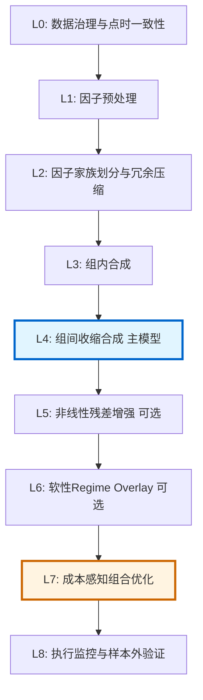

# Design Document: 弱因子组合量化策略 (Weak Factor Portfolio Strategy)

## Overview

弱因子组合量化策略是一套成熟的、可生产的A股股票横截面因子合成框架，专门用于处理100-500个弱因子的合成与组合构建。该策略采用"分层收缩合成 + OOF叠加 + 成本感知组合优化"的核心理念，将因子合成层与组合构建层彻底分离，通过收缩方法而非复杂模型来处理高维弱信号，并显式考虑交易成本、风险约束和容量限制。

核心设计哲学：**Hierarchical Shrinkage Ensemble with Optimizer-Aware Alpha**

该策略适用于周频或月频选股，支持long-only和market-neutral两种模式，强调点时一致性(point-in-time consistency)、样本外验证(out-of-sample validation)和成本感知优化(cost-aware optimization)。

## Architecture

整体架构采用8层设计，从数据治理到执行监控形成完整闭环：



### 主要数据流

```mermaid
sequenceDiagram
    participant Data as 数据层
    participant Factor as 因子层
    participant Synthesis as 合成层
    participant Portfolio as 组合层
    participant Execution as 执行层
    
    Data->>Factor: 原始因子 X[t,i,k]
    Factor->>Factor: 预处理(去极值/标准化/中性化)
    Factor->>Synthesis: 清洗后因子
    Synthesis->>Synthesis: 家族划分
    Synthesis->>Synthesis: 组内合成(equal-rank/ridge/PC1)
    Synthesis->>Synthesis: 组间收缩合成
    Synthesis->>Portfolio: alpha_score[t,i]
    Portfolio->>Portfolio: 风险模型 + 成本模型
    Portfolio->>Portfolio: 二次规划优化
    Portfolio->>Execution: 权重 w[t,i]
    Execution->>Execution: 交易执行与监控
    Execution-->>Synthesis: 反馈(realized alpha vs expected)
