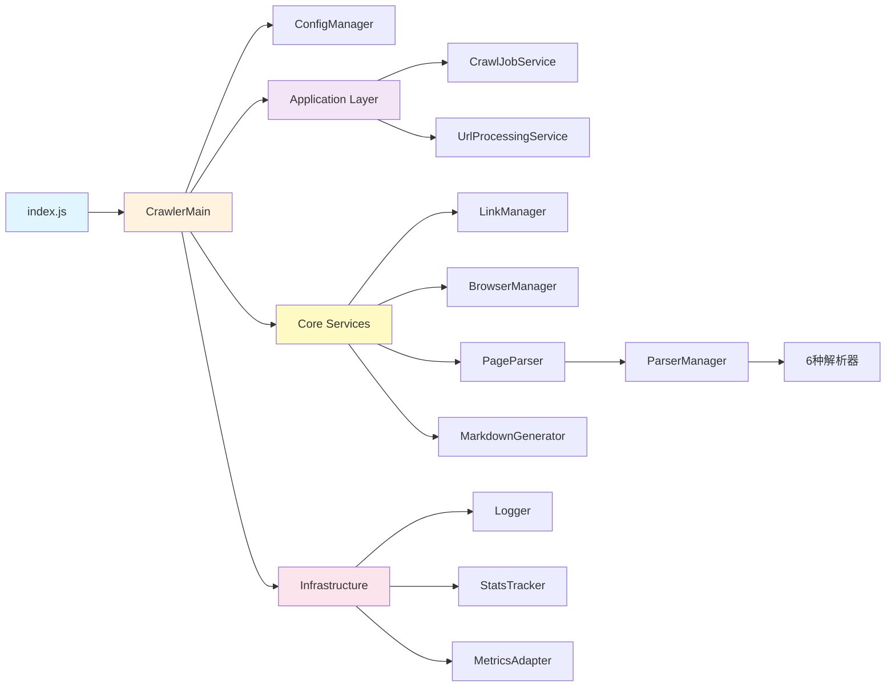
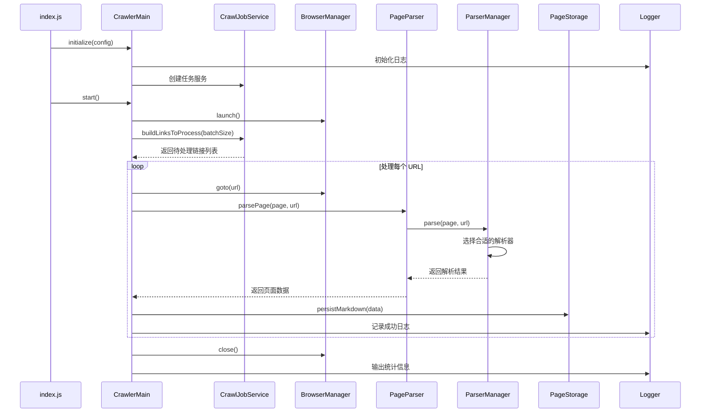
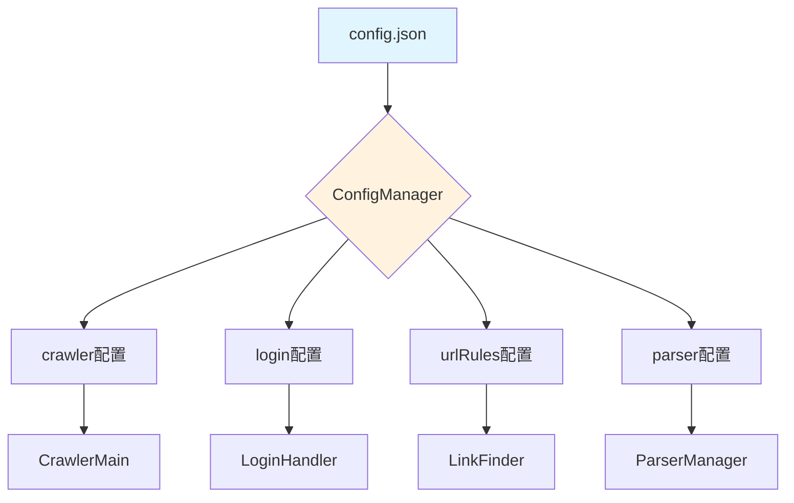

# Stock Crawler 架构调用框图

## 整体架构图

```mermaid
graph TB
    %% 入口层
    CLI[index.js<br/>CLI Entry Point]
    
    %% 主控制器
    MAIN[CrawlerMain<br/>主控制器]
    
    %% 配置层
    CONFIG[ConfigManager<br/>配置管理]
    
    %% Application 层 - 业务编排
    subgraph Application["Application Layer (业务编排)"]
        CRAWLJOB[CrawlJobService<br/>任务调度服务]
        URLPROC[UrlProcessingService<br/>URL处理服务]
    end
    
    %% Domain 层 - 业务规则
    subgraph Domain["Domain Layer (业务规则)"]
        RETRY[RetryPolicy<br/>重试策略]
        STATE[UrlStateMachine<br/>URL状态机]
    end
    
    %% 核心功能层
    subgraph Core["Core Services (核心服务)"]
        LINK[LinkManager<br/>链接管理]
        BROWSER[BrowserManager<br/>浏览器管理]
        LOGIN[LoginHandler<br/>登录处理]
        LINKFIND[LinkFinder<br/>链接发现]
        PARSER[PageParser<br/>页面解析器]
        MDGEN[MarkdownGenerator<br/>Markdown生成]
        LLM[LLMDataExtractor<br/>LLM数据提取]
    end
    
    %% Parser 子系统
    subgraph Parsers["Parser Subsystem (解析器子系统)"]
        PMGR[ParserManager<br/>解析器管理器]
        PCLASS[PageClassifier<br/>页面分类器]
        
        subgraph ParserTypes["Parser Types"]
            PAPI[ApiDocParser<br/>API文档解析]
            PCORE[CoreContentParser<br/>核心内容解析]
            PDIR[DirectoryParser<br/>目录解析]
            PGEN[GenericParser<br/>通用解析]
            PLIST[ListParser<br/>列表解析]
            PTABLE[TableOnlyParser<br/>纯表格解析]
        end
    end
    
    %% Storage 层
    subgraph Storage["Storage Layer (存储层)"]
        PSTORAGE[PageStorage<br/>页面存储]
    end
    
    %% Infrastructure 层
    subgraph Infrastructure["Infrastructure Layer (基础设施)"]
        LOGGER[Logger<br/>日志记录]
        STATS[StatsTracker<br/>统计追踪]
        METRICS[MetricsAdapter<br/>指标适配器]
    end
    
    %% 调用关系
    CLI --> MAIN
    
    MAIN --> CONFIG
    MAIN --> LINK
    MAIN --> BROWSER
    MAIN --> LOGIN
    MAIN --> LINKFIND
    MAIN --> PARSER
    MAIN --> MDGEN
    MAIN --> LLM
    MAIN --> LOGGER
    MAIN --> STATS
    MAIN --> PSTORAGE
    MAIN --> CRAWLJOB
    MAIN --> URLPROC
    MAIN --> METRICS
    
    %% Application 层调用
    CRAWLJOB --> LINK
    CRAWLJOB --> CONFIG
    URLPROC --> LINK
    URLPROC --> RETRY
    URLPROC --> STATE
    
    %% Parser 调用链
    PARSER --> PMGR
    PMGR --> PCLASS
    PMGR --> PAPI
    PMGR --> PCORE
    PMGR --> PDIR
    PMGR --> PGEN
    PMGR --> PLIST
    PMGR --> PTABLE
    
    %% 基础设施调用
    MAIN -.日志.-> LOGGER
    CRAWLJOB -.日志.-> LOGGER
    URLPROC -.日志.-> LOGGER
    PARSER -.日志.-> LOGGER
    
    MAIN -.统计.-> STATS
    MAIN -.指标.-> METRICS
    
    %% 存储调用
    MAIN --> PSTORAGE
    
    %% 样式定义
    classDef entryClass fill:#e1f5ff,stroke:#01579b,stroke-width:3px
    classDef mainClass fill:#fff3e0,stroke:#e65100,stroke-width:3px
    classDef appClass fill:#f3e5f5,stroke:#4a148c,stroke-width:2px
    classDef domainClass fill:#e8f5e9,stroke:#1b5e20,stroke-width:2px
    classDef coreClass fill:#fff9c4,stroke:#f57f17,stroke-width:2px
    classDef parserClass fill:#e0f2f1,stroke:#004d40,stroke-width:2px
    classDef infraClass fill:#fce4ec,stroke:#880e4f,stroke-width:2px
    classDef storageClass fill:#e3f2fd,stroke:#0d47a1,stroke-width:2px
    
    class CLI entryClass
    class MAIN mainClass
    class CRAWLJOB,URLPROC appClass
    class RETRY,STATE domainClass
    class LINK,BROWSER,LOGIN,LINKFIND,PARSER,MDGEN,LLM coreClass
    class PMGR,PCLASS,PAPI,PCORE,PDIR,PGEN,PLIST,PTABLE parserClass
    class LOGGER,STATS,METRICS infraClass
    class PSTORAGE storageClass
```



## 分层架构说明

### 1. Entry Point (入口层)
- **index.js**: CLI 入口，解析命令行参数，启动爬虫

### 2. Main Controller (主控制器)
- **CrawlerMain**: 核心编排器，协调所有组件完成爬取任务

### 3. Application Layer (应用层 - 业务编排)
- **CrawlJobService**: 任务调度，构建待处理链接列表，URL 优先级排序
- **UrlProcessingService**: URL 处理流程编排，状态管理，重试逻辑

### 4. Domain Layer (领域层 - 业务规则)
- **RetryPolicy**: 重试策略规则（按错误类型差异化重试）
- **UrlStateMachine**: URL 状态转换规则（unfetched → fetching → fetched/failed）

### 5. Core Services (核心服务层)
- **ConfigManager**: 配置文件加载和验证
- **LinkManager**: 链接的增删改查，状态管理
- **BrowserManager**: Playwright 浏览器生命周期管理
- **LoginHandler**: 登录检测和执行
- **LinkFinder**: 从页面中发现新链接
- **PageParser**: 页面解析入口（委托给 ParserManager）
- **MarkdownGenerator**: 生成 Markdown 文档
- **LLMDataExtractor**: LLM 结构化数据提取

### 6. Parser Subsystem (解析器子系统)
- **ParserManager**: 解析器管理器，根据页面类型选择合适的解析器
- **PageClassifier**: 页面分类器，识别页面类型
- **解析器类型**:
  - ApiDocParser: API 文档页面
  - CoreContentParser: 核心内容页面
  - DirectoryParser: 目录列表页面
  - GenericParser: 通用页面
  - ListParser: 列表页面
  - TableOnlyParser: 纯表格页面

### 7. Storage Layer (存储层)
- **PageStorage**: 页面内容持久化（文件系统 / LanceDB）

### 8. Infrastructure Layer (基础设施层)
- **Logger**: 日志记录（文件 + 控制台）
- **StatsTracker**: 统计信息追踪
- **MetricsAdapter**: 指标收集适配器

## 调用流程示例

### 启动流程
```
index.js 
  → CrawlerMain.initialize(configPath)
    → ConfigManager.loadConfig()
    → LinkManager.loadLinks()
    → Logger.initialize()
    → PageStorage.initialize()
    → CrawlJobService.new()
  → CrawlerMain.start()
    → BrowserManager.launch()
    → LoginHandler.login() (如果需要)
    → CrawlJobService.buildLinksToProcess()
```

### 单个 URL 处理流程
```
CrawlerMain.processUrl(url)
  → UrlProcessingService.markFetching(url)
  → BrowserManager.goto(url)
  → LoginHandler.needsLogin() / login() (如果需要)
  → LinkFinder.extractLinks()
    → LinkManager.addLink()
  → PageParser.parsePage()
    → ParserManager.parse()
      → PageClassifier.classify()
      → [选择的Parser].parse()
  → LLMDataExtractor.extract() (如果启用)
  → MarkdownGenerator.generate()
  → PageStorage.persistMarkdown()
  → UrlProcessingService.markFetched(url)
  → MetricsAdapter.increment('crawl_success_total')
```

## 依赖方向原则

1. **上层依赖下层**: Application → Domain → Core → Infrastructure
2. **同层不互相依赖**: Application 层的服务之间不直接调用
3. **通过接口解耦**: Parser 通过 Manager 统一管理
4. **基础设施被动调用**: Logger、Metrics 只被调用，不主动调用业务逻辑

## 扩展点

### 添加新的解析器
```
src/parsers/
  └── new-parser.js (实现 BaseParser 接口)
      ↓
  parser-manager.js (注册新解析器)
      ↓
  page-classifier.js (添加分类规则)
```

### 添加新的存储后端
```
src/storage/
  └── new-storage-adapter.js (实现 Storage 接口)
      ↓
  page-storage.js (配置选择)
```

### 添加新的业务流程
```
src/application/
  └── new-service.js (编排新的业务流程)
      ↓
  crawler-main.js (调用新服务)
```

## 测试策略

- **单元测试**: 每个类独立测试（mock 依赖）
- **集成测试**: 测试类之间的协作
- **契约测试**: 测试接口契约（Parser、Storage）
- **E2E 测试**: 完整流程测试（固定站点快照）


---

## 简化版调用关系图



## 核心类职责速查表

| 类名 | 层级 | 职责 | 依赖 |
|------|------|------|------|
| **index.js** | Entry | CLI 入口，参数解析 | CrawlerMain |
| **CrawlerMain** | Controller | 主流程编排，组件协调 | 所有核心组件 |
| **CrawlJobService** | Application | 任务调度，URL 优先级排序 | LinkManager, Config |
| **UrlProcessingService** | Application | URL 处理流程，状态管理 | LinkManager, RetryPolicy |
| **RetryPolicy** | Domain | 重试策略规则 | - |
| **UrlStateMachine** | Domain | URL 状态转换规则 | - |
| **ConfigManager** | Core | 配置加载和验证 | - |
| **LinkManager** | Core | 链接增删改查，状态管理 | - |
| **BrowserManager** | Core | 浏览器生命周期管理 | Playwright |
| **LoginHandler** | Core | 登录检测和执行 | - |
| **LinkFinder** | Core | 页面链接发现 | - |
| **PageParser** | Core | 页面解析入口 | ParserManager |
| **ParserManager** | Parser | 解析器选择和调度 | 6种解析器 |
| **PageClassifier** | Parser | 页面类型识别 | - |
| **ApiDocParser** | Parser | API 文档解析 | BaseParser |
| **CoreContentParser** | Parser | 核心内容解析 | BaseParser |
| **DirectoryParser** | Parser | 目录列表解析 | BaseParser |
| **GenericParser** | Parser | 通用页面解析 | BaseParser |
| **ListParser** | Parser | 列表页面解析 | BaseParser |
| **TableOnlyParser** | Parser | 纯表格解析 | BaseParser |
| **MarkdownGenerator** | Core | Markdown 文档生成 | - |
| **LLMDataExtractor** | Core | LLM 数据提取 | - |
| **PageStorage** | Storage | 页面持久化 | File/LanceDB |
| **Logger** | Infrastructure | 日志记录 | - |
| **StatsTracker** | Infrastructure | 统计追踪 | - |
| **MetricsAdapter** | Infrastructure | 指标收集 | - |

## 数据流向图



## 关键设计模式

### 1. 策略模式 (Strategy Pattern)
- **ParserManager** 根据页面类型选择不同的解析器
- 每个解析器实现相同的接口但有不同的解析策略

### 2. 工厂模式 (Factory Pattern)
- **ParserManager** 作为工厂创建和管理解析器实例

### 3. 适配器模式 (Adapter Pattern)
- **MetricsAdapter** 适配不同的指标收集后端
- **PageStorage** 适配不同的存储后端（文件/数据库）

### 4. 模板方法模式 (Template Method Pattern)
- **BaseParser** 定义解析流程模板
- 子类解析器实现具体的解析步骤

### 5. 单例模式 (Singleton Pattern)
- **Logger** 在整个应用中共享同一个实例

### 6. 服务层模式 (Service Layer Pattern)
- **Application Layer** 的服务类封装业务流程
- 提供粗粒度的业务操作接口

## 配置驱动架构



配置文件驱动整个爬虫的行为，无需修改代码即可适配不同网站。
