# 聚宽策略库“策略生长树”研究设计文档

## 1. 目标

这份设计文档用于把 [聚宽有价值策略558](/Users/fengzhi/Downloads/git/testlixingren/聚宽有价值策略558) 从“按编号堆放的策略集合”整理成一个可研究、可扩展、可持续补充的“策略生长树”。

本项目的目标不是立刻判断 500 多个文件谁最好，而是先建立一套后续可以反复复用的研究框架：

1. 先按大逻辑分类，而不是按编号顺序硬看。
2. 允许一个编号下有多个不同逻辑，不强行把“01-100”当成 100 个独立策略。
3. 每篇策略都做归类、打标签、标注是否值得深挖。
4. 最终形成一棵“从母逻辑到变体到具体文件”的策略生长树。

## 2. 本次设计的边界

本阶段先做研究框架，不做以下事情：

1. 不逐篇给出完整回测复核结论。
2. 不对全部策略做统一标准化回测。
3. 不强行输出 100 个编号的逐项报告。
4. 不把标题里的年化、回撤直接当成真实性结论。

本阶段要产出的，是一份后续研究工作可以直接照着执行的结构化主纲。

## 3. 核心原则

### 3.1 以“逻辑”优先，不以“编号”优先

同一个编号下可能同时出现：

1. ETF 轮动
2. 小市值选股
3. 打板龙头
4. 研究 notebook

因此编号只能作为“收纳目录”，不能直接等同于“策略类别”。

### 3.2 一篇策略可以多标签

例如：

`PEG + 小市值 + RSRS择时`

它至少同时属于：

1. `基本面/因子`
2. `小市值`
3. `择时`
4. `周/月度轮动`

因此分类采用“主类 + 次类 + 标签”而不是单选。

### 3.3 区分“母逻辑”和“参数变体”

很多标题不同的策略，本质上只是：

1. 同一母策略加一个风控
2. 同一母策略换一个因子
3. 同一母策略加一个空仓条件
4. 同一母策略从股票换成 ETF

后续研究要优先识别“母策略”，避免被大量变体淹没。

### 3.4 区分“研究价值”和“直接实盘价值”

有些策略研究价值高，但不适合直接实盘：

1. 龙头打板
2. 首板低开
3. 龙虎榜挖掘
4. 高频分钟级价量

有些策略收益不最炸，但更适合作为长期跟踪母体：

1. ETF 轮动
2. 基本面三角
3. 红利/价值
4. 全天候/股债配置

## 4. 研究输出的最终形态

整个项目后续建议产出 4 份长期维护的主文件。

### 4.1 总索引

文件建议名：

`聚宽策略总索引.md`

作用：

1. 按主类列出所有策略
2. 每个策略给出编号、标题、主类、标签、深挖状态

### 4.2 生长树主文档

文件建议名：

`策略生长树.md`

作用：

1. 展示母逻辑
2. 展示主要分叉
3. 展示典型代表作
4. 展示逻辑之间的继承关系

### 4.3 编号组摘要

文件建议名：

`编号组摘要.md`

作用：

1. 每个编号下面有哪些策略
2. 每篇各属于什么逻辑
3. 该编号是否值得继续拆

### 4.4 深挖清单

文件建议名：

`深挖优先级清单.md`

作用：

1. 按优先级列出值得进一步验证的母策略
2. 标注研究原因
3. 标注风险点

## 5. 分类体系设计

分类采用“三层结构”：

1. `主类`：几十个大的逻辑母树
2. `子类`：更具体的方法族
3. `标签`：规模、频率、择时、风控、市场环境等属性

---

## 6. 第一版主类树

这批策略库建议先按下面 14 个主类建立第一版主树。

### A. ETF/指数轮动

子类：

1. 宽基 ETF 动量轮动
2. 行业/主题 ETF 轮动
3. 相关性最小化轮动
4. 候选池动态筛选轮动
5. ETF + RSRS/BBI/均线择时
6. ETF + 债券/货基防守

代表母逻辑：

1. 动量排序
2. Sharpe 排序
3. 斜率回归打分
4. 相关性最小化
5. 趋势筛选后再轮动

### B. 小市值/微盘

子类：

1. 纯市值排序
2. 小市值 + 盈利过滤
3. 小市值 + 红利
4. 小市值 + 国九条过滤
5. 微盘再平衡
6. 小市值 + 月度空仓机制

### C. 价值/红利/高股息

子类：

1. 高股息
2. 红利增强
3. 价值低波
4. 大市值价值
5. ROE/PB/ROA/ROIC 组合
6. 漂亮 50/价值精选

### D. 基本面多因子

子类：

1. PEG/EBIT/ROE/成长
2. F-Score/FFScore
3. 基本面三角
4. 模板分位法
5. 线性打分模型
6. 指数增强型基本面策略

### E. 机器学习选股

子类：

1. 线性回归
2. SVR
3. 随机森林
4. XGBoost
5. 动态多因子机器学习
6. 强化学习/DQN
7. 深度学习/BiLSTM

### F. 行业轮动/板块轮动

子类：

1. 趋势-拥挤-景气轮动
2. 行业宽度轮动
3. 行业反转效应
4. 板块热度/打分轮动
5. 强势行业 + 强势个股

### G. 北向资金/资金流

子类：

1. 北向净流入择时
2. 北向持股比例选股
3. 北向 + ETF 组合
4. 北向 + 创业板/风格轮动

### H. 大盘择时/市场状态

子类：

1. RSRS
2. 市场宽度
3. 拥挤率
4. BBI/均线/布林
5. 情绪指数
6. 宏观择时
7. 风险溢价
8. 牛熊指标/VIX/FED 类信号

### I. 短线趋势/动量

子类：

1. 强者恒强
2. 趋势突破
3. MACD/TD/海龟
4. 超跌反弹
5. 错杀反弹
6. 开盘幅度/7日趋势

### J. 打板/龙头/竞价

子类：

1. 首板低开
2. 弱转强
3. 龙回头
4. 连板龙头
5. 竞价量比
6. 炸板股/反包
7. 234 板介入

### K. 网格/定投/基金增强

子类：

1. ETF 网格
2. 超跌网格
3. 基金定投增强
4. 红利定投
5. 基金抱团/基金跟随

### L. 股债配置/全天候/FOF

子类：

1. 全天候
2. 股债波动平衡
3. 国债增强
4. FOF/养老组合
5. 货基防守组合

### M. 期货/CTA/套利

子类：

1. 股指 CTA
2. 周内+日内效应
3. 收盘折溢价
4. 贴水套利
5. 融券做空
6. 商品期货 CTA

### N. 研究工具/框架/方法论

子类：

1. 因子研究 notebook
2. ETF 候选池构建
3. 回测提速
4. 数据清洗
5. 指标复现
6. 研究环境工具

---

## 7. 标签体系设计

每篇策略除了主类/子类外，再挂一组标签。

### 7.1 标的标签

1. `A股个股`
2. `ETF`
3. `指数`
4. `期货`
5. `可转债`
6. `基金`
7. `混合组合`

### 7.2 规模风格标签

1. `微盘`
2. `小盘`
3. `中盘`
4. `大盘`
5. `全A`
6. `行业`
7. `宽基`
8. `主题`

### 7.3 频率标签

1. `日频`
2. `周频`
3. `月频`
4. `季频`
5. `日内`
6. `分钟级`

### 7.4 择时标签

1. `无择时`
2. `均线`
3. `RSRS`
4. `情绪`
5. `北向`
6. `宏观`
7. `市场宽度`
8. `拥挤率`
9. `波动率`

### 7.5 风控标签

1. `止损`
2. `炸板卖出`
3. `涨停打开卖出`
4. `空仓月份`
5. `ETF避险`
6. `货基避险`
7. `仓位分层`
8. `组合再平衡`

### 7.6 研究属性标签

1. `母策略`
2. `衍生版`
3. `实盘导向`
4. `研究导向`
5. `高摩擦`
6. `低摩擦`
7. `高容量`
8. `低容量`

## 8. “是否值得深挖”的判定规则

每篇策略不直接写“好/坏”，而是打下面 6 个维度。

### 8.1 评分维度

1. `逻辑清晰度`
2. `可解释性`
3. `实盘摩擦`
4. `容量/流动性`
5. `风格依赖度`
6. `过拟合风险`

### 8.2 深挖标记

建议采用 4 档：

1. `S`：优先深挖
2. `A`：值得深挖
3. `B`：可做旁支研究
4. `C`：仅归档，不优先投入

### 8.3 深挖优先级的判断口径

#### 优先给 S/A 的典型情况

1. 母逻辑明确，很多变体都围着它长出来
2. 低换手、低摩擦、可长期跟踪
3. 能做模块化拆解
4. 能与别的策略组合
5. 不完全依赖某一段极端风格行情

#### 降级到 B/C 的典型情况

1. 标题收益极高但实现依赖强行情环境
2. 强依赖竞价、排板、盘口、成交顺序
3. 过多参数阈值，调参痕迹重
4. 逻辑描述弱于回测结果展示
5. 容量非常小

## 9. 编号组摘要的记录模板

后续每个编号组建议按同一模板写，避免风格飘。

### 9.1 编号组头部

1. `编号`
2. `组内文件数`
3. `核心主类`
4. `是否混杂多个大逻辑`
5. `是否存在母策略/变体关系`

### 9.2 组内单篇记录

每篇至少记录：

1. `标题`
2. `文件类型`
3. `主类`
4. `子类`
5. `关键标签`
6. `一句话逻辑`
7. `是否为母策略/衍生版`
8. `是否值得深挖`
9. `备注`

### 9.3 示例

| 编号 | 标题 | 主类 | 子类 | 标签 | 深挖 |
|---|---|---|---|---|---|
| 42 | 大盘ETF动量轮动 RSRS择时策略 | ETF/指数轮动 | 宽基 ETF + RSRS | ETF, 宽基, 日频, RSRS, 低摩擦 | A |
| 60 | 可能是最接近实盘的基本面三角 | 基本面多因子 | 基本面三角 | A股个股, 基本面, 月频, 价值, 实盘导向 | S |
| 78 | 首板低开策略-终极版 | 打板/龙头/竞价 | 首板低开 | A股个股, 短线, 竞价, 高摩擦 | B |

## 10. 编号组和生长树之间的映射规则

后续整理时采用下面的归属原则：

1. 编号组不是树节点，策略逻辑才是树节点。
2. 同一编号可拆到多个树枝。
3. 同一标题重复出现时，以“最完整版本”为主节点，其他版本挂在其下作为变体。
4. `txt` 为策略实现时优先看代码。
5. `ipynb` 为研究稿时优先归入“研究工具/方法论”或对应主类的“研究分支”。

## 11. 建议的研究顺序

你后面是按类别逐一研究，所以建议先走“低噪音、母逻辑清晰”的几条干线。

### 第一批

1. ETF/指数轮动
2. 基本面多因子
3. 价值/红利/高股息
4. 小市值/国九条

理由：

1. 母策略重复出现最多
2. 容易做横向比较
3. 可解释性较强
4. 与后续组合研究衔接最好

### 第二批

1. 行业轮动/北向/大盘择时
2. 股债配置/全天候
3. 期货/CTA/套利

理由：

1. 更偏组合层和择时层
2. 适合在主策略识别后再接入

### 第三批

1. 打板/龙头/竞价
2. 短线趋势/超跌反弹
3. 高频分钟级研究
4. 机器学习深度版

理由：

1. 信号更敏感
2. 参数和执行摩擦更重
3. 容易在早期研究中带偏判断

## 12. 第一版“策略生长树”草图

```mermaid
graph TD
    A["策略库"] --> B["ETF/指数轮动"]
    A --> C["小市值/微盘"]
    A --> D["价值/红利"]
    A --> E["基本面多因子"]
    A --> F["机器学习选股"]
    A --> G["行业/北向/择时"]
    A --> H["短线趋势"]
    A --> I["打板/龙头/竞价"]
    A --> J["网格/定投"]
    A --> K["股债配置/全天候"]
    A --> L["期货/CTA/套利"]
    A --> M["研究工具/方法论"]

    B --> B1["宽基动量"]
    B --> B2["RSRS/BBI/均线择时"]
    B --> B3["相关性最小化"]
    B --> B4["动态候选池"]

    C --> C1["经典小市值"]
    C --> C2["微盘再平衡"]
    C --> C3["国九条过滤"]
    C --> C4["小市值+红利"]

    D --> D1["高股息"]
    D --> D2["红利增强"]
    D --> D3["大市值价值"]

    E --> E1["PEG/EBIT/ROE"]
    E --> E2["F-Score/FFScore"]
    E --> E3["基本面三角"]
    E --> E4["模板分位法"]

    F --> F1["线性模型"]
    F --> F2["随机森林/SVR"]
    F --> F3["XGBoost"]
    F --> F4["强化学习/深度学习"]

    G --> G1["行业轮动"]
    G --> G2["北向资金"]
    G --> G3["市场宽度/拥挤"]
    G --> G4["宏观/情绪/VIX"]

    I --> I1["首板低开"]
    I --> I2["龙回头"]
    I --> I3["弱转强/竞价"]
```

## 13. 当前已识别出的高价值母树

基于第一轮扫描，当前最值得作为“母树主干”优先研究的，是下面 8 条：

1. `ETF动量 + RSRS/趋势择时`
2. `相关性最小化 ETF 轮动`
3. `经典小市值/微盘再平衡`
4. `国九条过滤 + 小盘红利`
5. `基本面三角`
6. `高股息/红利增强`
7. `行业趋势-拥挤-景气轮动`
8. `全天候/股债配置低回撤框架`

这 8 条更像“母根”，很多其他文件都能挂到这些主干下面。

## 14. 后续执行建议

下一步建议不要立刻按 01 到 100 顺着看，而是按下面方式推进：

1. 先建立“主类总索引”
2. 每次只处理一个主类
3. 每个主类下再拆“母策略”和“变体”
4. 最后再回头写编号组摘要

这样做的好处是：

1. 不会被编号打散注意力
2. 更容易看出哪些只是同一策略的改版
3. 更适合你后面按类别逐一深入

## 15. 本设计文档对应的第一批工作包

建议下一轮就从下面 4 个主类开始建索引：

1. `ETF/指数轮动`
2. `小市值/微盘`
3. `价值/红利/基本面`
4. `行业/北向/择时`

每个主类输出：

1. 主类说明
2. 子类树
3. 代表文件列表
4. 值得深挖的母策略
5. 不建议优先投入的旁支

---

这份文档的作用，是把后续研究从“看很多文件”变成“沿着树修枝、挂标签、挑母树”。
