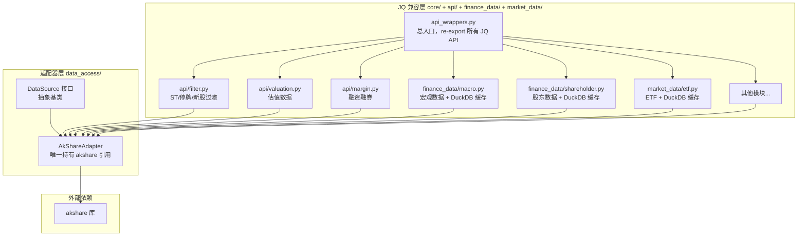
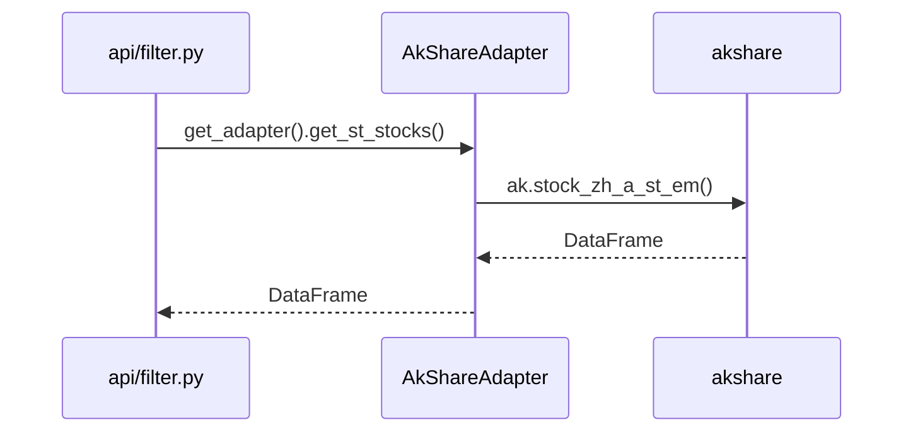
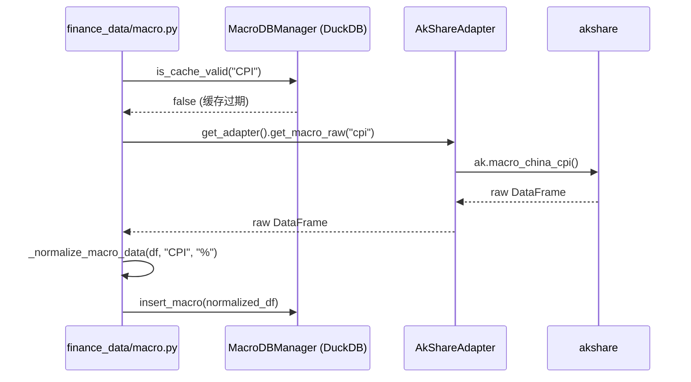

# Design Document: AkShare Adapter Consolidation

## Overview

当前代码库中 `akshare` 被分散在 20+ 个文件中直接调用，导致依赖耦合严重、难以统一管理重试/缓存/降级逻辑。本方案将所有 akshare 调用收拢到 `AkShareAdapter`，建立清晰的两层架构：底层是唯一碰 akshare 的适配器层，上层是对外暴露聚宽风格 API 的 JQ 兼容层。

重构完成后，`grep -r "import akshare" jk2bt/` 仅在 `akshare_adapter.py` 中出现。

---

## Architecture



**关键约束**：JQ 兼容层的所有模块只能通过 `get_adapter()` 调用 `AkShareAdapter`，不得直接 `import akshare`。

---

## 模块分类与重构策略

### 薄逻辑模块（主要做列名映射）

这类模块当前直接调 akshare + 简单列名映射，重构后改为调 DataSource 接口：

| 模块 | 当前问题 | 重构方式 |
|------|---------|---------|
| `api/filter.py` | `filter_st`/`filter_paused`/`get_margine_stocks` 直接调 `ak.stock_zh_a_st_em()` 等 | 改为 `get_adapter().get_st_stocks()` |
| `api/valuation.py` | `get_index_valuation` 直接调 `ak.index_value_hist_fina()` | 改为 `get_adapter().get_index_valuation()` |
| `api/margin.py` | `_get_market_mtss`/`get_margincash_stocks` 直接调 `ak.stock_margin_detail_sse/szse()` | 改为 `get_adapter().get_margin_detail()` |

### 厚逻辑模块（有完整 DuckDB 缓存管理）

这类模块有自己的缓存层和数据标准化逻辑，akshare 只是数据来源之一。重构策略：**只替换 akshare 调用点，缓存/标准化逻辑保留原地**。

| 模块 | 保留逻辑 | 替换内容 |
|------|---------|---------|
| `finance_data/macro.py` | `MacroDBManager`、`_normalize_macro_data`、`RobustResult` 封装 | `import akshare as ak` → `get_adapter().get_macro_raw(indicator)` |
| `finance_data/shareholder.py` | DuckDB 缓存管理、数据标准化 | akshare 调用点替换 |
| `market_data/etf.py` | DuckDB 缓存管理 | akshare 调用点替换 |
| `utils/data_source_backup.py` | 备用数据源逻辑 | akshare 调用点替换 |
| `db/meta_cache_api.py` | 元数据缓存管理 | akshare 调用点替换 |

---

## DataSource 接口扩展

现有 `DataSource` 接口只覆盖行情类方法，需新增以下方法定义：

```python
class DataSource(ABC):

    # ── 已有方法（保持不变）──────────────────────────────────────
    # get_daily_data, get_index_stocks, get_index_components
    # get_trading_days, get_securities_list, get_security_info
    # get_minute_data, get_money_flow, get_north_money_flow
    # get_industry_stocks, get_industry_mapping, get_finance_indicator
    # get_call_auction

    # ── 新增：ST/停牌 ─────────────────────────────────────────────
    def get_st_stocks(self) -> pd.DataFrame: ...
    # 返回: DataFrame with columns [代码, 名称]

    def get_suspended_stocks(self) -> pd.DataFrame: ...
    # 返回: DataFrame with columns [代码, 名称]

    # ── 新增：估值 ────────────────────────────────────────────────
    def get_index_valuation(self, index_code: str) -> pd.DataFrame: ...
    # 替代: ak.index_value_hist_fina()

    def get_stock_valuation(self, symbol: str) -> pd.DataFrame: ...
    # 替代: ak.stock_a_lg_indicator()

    # ── 新增：融资融券 ────────────────────────────────────────────
    def get_margin_detail(self, market: str, date: str) -> pd.DataFrame: ...
    # market: "sh" | "sz"
    # 替代: ak.stock_margin_detail_sse/szse()

    def get_margin_underlying(self, market: str) -> pd.DataFrame: ...
    # 替代: ak.stock_margin_underlying_info_sse/szse()

    # ── 新增：宏观数据（原始数据，不含缓存逻辑）─────────────────
    def get_macro_raw(self, indicator: str) -> pd.DataFrame: ...
    # indicator: "pmi" | "cpi" | "ppi" | "gdp" | "m2" | "interest_rate" | "exchange_rate"
    # 返回 akshare 原始 DataFrame，缓存逻辑由 macro.py 自己管理

    # ── 新增：股东数据 ────────────────────────────────────────────
    def get_top10_holders(self, symbol: str) -> pd.DataFrame: ...
    def get_top10_float_holders(self, symbol: str) -> pd.DataFrame: ...
    def get_holder_count(self, symbol: str) -> pd.DataFrame: ...

    # ── 新增：分红/股本 ───────────────────────────────────────────
    def get_dividend(self, symbol: str) -> pd.DataFrame: ...
    def get_share_change(self, symbol: str) -> pd.DataFrame: ...

    # ── 新增：财务报表 ────────────────────────────────────────────
    def get_stock_financial_report(self, symbol: str, report_type: str) -> pd.DataFrame: ...
    # report_type: "现金流量表" | "资产负债表" | "利润表"

    # ── 新增：龙虎榜 ──────────────────────────────────────────────
    def get_billboard_list(self, date: str) -> pd.DataFrame: ...

    # ── 新增：ETF/LOF ─────────────────────────────────────────────
    def get_etf_hist(self, symbol: str) -> pd.DataFrame: ...
    def get_lof_hist(self, symbol: str) -> pd.DataFrame: ...

    # ── 新增：行业/概念 ───────────────────────────────────────────
    def get_industry_list(self, source: str = "em") -> pd.DataFrame: ...
    def get_industry_components(self, industry_name: str, source: str = "em") -> pd.DataFrame: ...
    def get_concept_list(self) -> pd.DataFrame: ...
    def get_concept_components(self, concept_name: str) -> pd.DataFrame: ...

    # ── 新增：可转债 ──────────────────────────────────────────────
    def get_conversion_bond_list(self) -> pd.DataFrame: ...
    def get_conversion_bond_daily(self, symbol: str) -> pd.DataFrame: ...

    # ── 新增：期货/期权 ───────────────────────────────────────────
    def get_futures_daily(self, contract_code: str) -> pd.DataFrame: ...
    def get_option_daily(self, option_code: str) -> pd.DataFrame: ...

    # ── 新增：解禁 ────────────────────────────────────────────────
    def get_unlock_schedule(self, symbol: str) -> pd.DataFrame: ...
```

---

## AkShareAdapter 扩展

在现有 `AkShareAdapter` 基础上实现所有新增接口方法，遵循统一的三段式模式：

```python
def get_st_stocks(self) -> pd.DataFrame:
    if not self._akshare_available:
        raise DataSourceError("akshare 不可用", source=self.name)
    try:
        return self._akshare.stock_zh_a_st_em()
    except Exception as e:
        raise DataSourceError(str(e), source=self.name)

def get_macro_raw(self, indicator: str) -> pd.DataFrame:
    """返回 akshare 原始数据，不做缓存（缓存由调用方 macro.py 管理）"""
    _indicator_map = {
        "pmi":           self._akshare.macro_china_pmi,
        "cpi":           self._akshare.macro_china_cpi,
        "ppi":           self._akshare.macro_china_ppi,
        "gdp":           self._akshare.macro_china_gdp,
        "m2":            self._akshare.macro_china_m2_yearly,
        "interest_rate": self._akshare.macro_bank_china_interest_rate,
        "exchange_rate": self._akshare.macro_china_rmb,
    }
    if not self._akshare_available:
        raise DataSourceError("akshare 不可用", source=self.name)
    fn = _indicator_map.get(indicator.lower())
    if fn is None:
        raise DataSourceError(f"不支持的宏观指标: {indicator}", source=self.name)
    try:
        return fn()
    except Exception as e:
        raise DataSourceError(str(e), source=self.name)

def get_margin_detail(self, market: str, date: str) -> pd.DataFrame:
    if not self._akshare_available:
        raise DataSourceError("akshare 不可用", source=self.name)
    try:
        if market == "sh":
            return self._akshare.stock_margin_detail_sse(date=date)
        elif market == "sz":
            return self._akshare.stock_margin_detail_szse(date=date)
        else:
            raise DataSourceError(f"不支持的市场: {market}", source=self.name)
    except DataSourceError:
        raise
    except Exception as e:
        raise DataSourceError(str(e), source=self.name)
```

---

## JQ 兼容层重构示例

### 薄逻辑模块：filter.py

```python
# 重构前
def filter_st(stock_list, date=None):
    import akshare as ak
    st_df = ak.stock_zh_a_st_em()
    ...

# 重构后
def filter_st(stock_list, date=None):
    from jk2bt.data_access import get_adapter
    st_df = get_adapter().get_st_stocks()
    ...
```

### 薄逻辑模块：valuation.py

```python
# 重构前
def get_index_valuation(index_code, ...):
    import akshare as ak
    df = ak.index_value_hist_fina(symbol=code)
    ...

# 重构后
def get_index_valuation(index_code, ...):
    from jk2bt.data_access import get_adapter
    df = get_adapter().get_index_valuation(code)
    ...
```

### 厚逻辑模块：macro.py（只替换调用点，保留缓存逻辑）

```python
# 重构前（get_macro_cpi 内部）
if need_download:
    import akshare as ak
    df = ak.macro_china_cpi()
    ...

# 重构后（只改这一行，其余 DuckDB 缓存逻辑不动）
if need_download:
    from jk2bt.data_access import get_adapter
    df = get_adapter().get_macro_raw("cpi")
    ...
```

---

## 全局单例工厂

```python
# jk2bt/data_access/__init__.py

_default_adapter: Optional[AkShareAdapter] = None

def get_adapter() -> AkShareAdapter:
    """获取全局默认 AkShareAdapter 单例"""
    global _default_adapter
    if _default_adapter is None:
        _default_adapter = AkShareAdapter()
    return _default_adapter

def set_adapter(adapter: AkShareAdapter) -> None:
    """替换全局适配器（用于测试注入）"""
    global _default_adapter
    _default_adapter = adapter
```

---

## Sequence Diagrams

### 薄逻辑模块重构后调用链



### 厚逻辑模块重构后调用链（缓存逻辑保留原地）



---

## Correctness Properties

1. **唯一 akshare 入口**：重构后 `grep -r "import akshare" jk2bt/` 仅在 `jk2bt/data_access/akshare_adapter.py` 中出现
2. **单例幂等性**：`get_adapter() is get_adapter()` — 同进程内返回同一实例
3. **接口稳定**：所有 JQ 兼容层函数的外部签名和返回格式不变
4. **厚逻辑模块缓存不受影响**：`macro.py`、`shareholder.py`、`etf.py` 的 DuckDB 缓存逻辑在重构前后行为一致
5. **错误传播**：所有 akshare 异常统一转换为 `DataSourceError`，不泄露 akshare 内部异常类型
6. **可测试性**：通过 `set_adapter(mock)` 可完全隔离 akshare 依赖进行单元测试

---

## Error Handling

### akshare 未安装

**Condition**: `import akshare` 失败
**Response**: `AkShareAdapter.__init__` 设置 `_akshare_available = False`，所有方法抛出 `DataSourceError("akshare 不可用")`
**Recovery**: 安装 akshare 后重新初始化适配器

### akshare API 调用失败（网络/限流）

**Condition**: `ak.xxx()` 抛出异常
**Response**: 按 `_max_retries` 次数重试，指数退避 `_retry_delay` 秒
**Recovery**: 超过重试次数后抛出 `DataSourceError`，厚逻辑模块可降级到 DuckDB 缓存

### 不支持的参数值

**Condition**: `get_macro_raw("unknown_indicator")`
**Response**: 立即抛出 `DataSourceError(f"不支持的宏观指标: unknown_indicator")`，不重试

---

## Testing Strategy

### Unit Testing

对每个新增 `AkShareAdapter` 方法编写单元测试，使用 `set_adapter(mock)` 隔离 akshare：

```python
def test_filter_st_uses_adapter():
    mock = MockAkShareAdapter()
    mock.get_st_stocks = lambda: pd.DataFrame({"代码": ["000001"], "名称": ["*ST平安"]})
    set_adapter(mock)
    result = filter_st(["000001.XSHE", "600519.XSHG"])
    assert "600519.XSHG" in result
    assert "000001.XSHE" not in result
```

### Property-Based Testing

**Library**: `hypothesis`

- `get_adapter()` 幂等性：多次调用返回同一对象
- 代码标准化：任意格式股票代码经 `_normalize_symbol` 后输出格式一致
- 错误隔离：akshare 抛出任意异常，适配器均转换为 `DataSourceError`

### Integration Testing

有网络环境下对少量真实 API 调用做冒烟测试，验证字段映射正确性。

---

## Dependencies

- `akshare >= 1.0.0`（可选，缺失时降级到缓存/离线模式）
- `pandas`
- `jk2bt.data_access.data_source.DataSourceError`
- `jk2bt.db.duckdb_manager.DuckDBManager`（厚逻辑模块自身依赖，不变）
